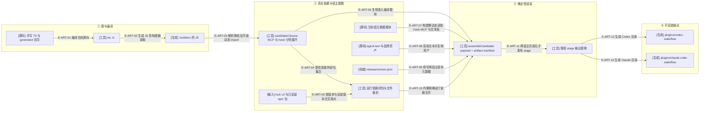

# 制品与合同：从源码到两个宿主可加载的目录

本仓库维护 Wakeflow 源码及生成插件。`src/` 的业务代码、Schema 派生合同、`assets/agent-text/` 与宿主 profile 是输入；`plugins/codex-wakeflow/`、`plugins/claude-code-wakeflow/` 是构建器输出，不能手改。以下按 **1.1.0-rc.5 源码候选**核验：本轮租约清理、隐私判定和回调渲染修正随真实编译闭包进入候选，Controller 技能由统一文本来源渲染。构建器字节与 rc.3 已核验基线相同；这里描述源码到候选的生成机制，不声明安装或宿主已加载。

### 本图术语说明

| 术语 | 含义 |
| --- | --- |
| 编译闭包 | 从每宿主 MCP 入口与共享 hook observer 入口出发，按编译后 JS 的真实 import 展开的模块集合；不是复制整个 src。 |
| 构建期动态读取 | 构建器通过固定配置路径 import 已编译宿主模块，取得 hook、MCP 配置和 agent-text 渲染函数；这与运行时静态 import 分开。 |
| 内置依赖 | 制品自带 node_modules 的运行文件，宿主无需替插件执行 npm install；不通过 bundling 隐藏领域文件。 |
| artifact-manifest | 每个 payload 文件的路径、字节数、sha256、模式及 scope，加入口/依赖/文本来源元数据；清单自身不递归列入 files。 |
| stage | 先把两个宿主都组装到临时目录，成功后才更换目标根；缺省输出在 .build，只有 --committed 选择 plugins。 |

### 本图边级证据

| 编号 | 代码证据 | 测试证据 |
| --- | --- | --- |
| E-ART-01 | root package.json 的 build:artifacts / build:artifacts:committed 先执行 tsc -b tooling 与 entrypoints 项目；`tooling/artifacts/build-plugin-artifacts.ts#buildWakeflowPluginArtifacts` 自身只消费编译产物。 | 未覆盖：npm script 到 tsc 的启动顺序来自实际脚本，构建函数测试不代替编译器调用证明。 |
| E-ART-02 | `tooling/artifacts/build-plugin-artifacts.ts#COMPILED_SOURCE_ROOT` 固定 .build/src；没有编译根则拒绝。 | 间接覆盖：`tests/artifacts/plugin-artifacts.test.ts#buildWakeflowPluginArtifacts` 消费真实编译根。 |
| E-ART-03 | `tooling/artifacts/build-plugin-artifacts.ts#compiledModuleClosure` 用 es-module-lexer，拒绝非字面动态 import、越界与非JS模块。 | 间接覆盖：`tests/artifacts/plugin-artifacts.test.ts#buildWakeflowPluginArtifacts` 检查完整闭包清单。 |
| E-ART-04 | `tooling/artifacts/build-plugin-artifacts.ts#candidateClosure` / assembleCandidate 将 closure.externalPackages 交依赖求解器。 | `tests/artifacts/plugin-artifacts.test.ts#resolveRuntimeDependencyClosure` |
| E-ART-05 | `tooling/artifacts/plugin-dependency-closure.ts#resolveRuntimeDependencyClosure` 读 lock v3，逐包 assertInstalledVersion。 | `tests/artifacts/plugin-dependency-closure.test.ts#resolveRuntimeDependencyClosure` |
| E-ART-06 | `tooling/artifacts/build-plugin-artifacts.ts#compiledFileScope` 拒对端执行模块；`assertSharedClosure` 拒 hook 闭包中的任何 hosts 模块。 | `tests/artifacts/plugin-artifacts.test.ts#assertSharedClosure` |
| E-ART-07 | `tooling/artifacts/build-plugin-artifacts.ts#importCompiledHostModule` 被 hooksJsonBytes / mcpConfigurationBytes / agentTextFiles 固定调用。 | 间接覆盖：`tests/artifacts/plugin-artifacts.test.ts#buildWakeflowPluginArtifacts` 比较渲染文件与源profile。 |
| E-ART-08 | `tooling/artifacts/build-plugin-artifacts.ts#agentTextFiles` 检查占位符闭合，staticAssetFiles 读取 LICENSE/brand。 | `tests/artifacts/plugin-artifacts.test.ts#buildWakeflowPluginArtifacts` |
| E-ART-09 | `tooling/artifacts/plugin-metadata.ts#readReleaseVersion` 为唯一版本输入；renderPluginManifest / renderPackageJson 被组装器使用。 | `tests/artifacts/plugin-artifacts.test.ts#readReleaseVersion` |
| E-ART-10 | `tooling/artifacts/plugin-dependency-closure.ts#collectVendoredFiles` 返回排序文件，assembleCandidate 以0644写出。 | `tests/artifacts/plugin-dependency-closure.test.ts#collectVendoredFiles` |
| E-ART-11 | `tooling/artifacts/build-plugin-artifacts.ts#buildWakeflowPluginArtifacts` 完成 CANDIDATES 循环后调用 replaceOutputAtomically。 | `tests/artifacts/plugin-artifacts.test.ts#buildWakeflowPluginArtifacts` |
| E-ART-12 | `tooling/artifacts/build-plugin-artifacts.ts#replaceOutputAtomically` 整根改名；`tooling/artifacts/plugin-metadata.ts#pluginDirectoryName` 给出Codex目录名。 | `tests/artifacts/plugin-artifact-check.test.ts#checkWakeflowPluginArtifacts` |
| E-ART-13 | 同一整组输出包含Claude目录；宿主专用文件在 CANDIDATES 中固定。 | `tests/artifacts/plugin-artifact-check.test.ts#checkWakeflowPluginArtifacts` |

### 每份制品实际包括什么

| 内容 | 来源与生成者 | 消费者 / 边界 |
| --- | --- | --- |
| lib/ | compiledModuleClosure 的JS集合，去掉尾部sourceMappingURL | 各宿主MCP入口和共享hook入口；不包括测试/tooling的运行逻辑。 |
| mcp/server.mjs | `tooling/artifacts/build-plugin-artifacts.ts#mcpLauncherBytes` | 调相应 runCodexWakeflowMcpStdio / runClaudeCodeWakeflowMcpStdio，携带唯一版本。 |
| hooks/observe.mjs | `tooling/artifacts/build-plugin-artifacts.ts#hookObserverLauncherBytes` | 动态导入共享observer；装载失败时固定stderr，exit0，不泄露路径/栈。 |
| hooks/hooks.json | `src/hosts/codex/codex-hook-fragment.ts#renderCodexHooksJson` / `src/hosts/claude-code/claude-code-hook-fragment.ts#renderClaudeCodeHooksJson` | 宿主读取；构建器复核渲染字节与profile声明摘要。 |
| .mcp.json | `src/hosts/codex/codex-process-launch-profile.ts#CODEX_MCP_CONFIGURATION` / `src/hosts/claude-code/claude-code-mcp-configuration.ts#CLAUDE_CODE_MCP_CONFIGURATION` | 宿主启动MCP；Codex优先宿主Node路径，Claude使用插件根参数。 |
| skills / README / commands | `src/hosts/codex/codex-agent-text-profile.ts#renderCodexAgentText` / `src/hosts/claude-code/claude-code-agent-text-profile.ts#renderClaudeCodeAgentText` | 当前宿主闭合占位符；Claude四commands，Codex不输出commands目录。 |
| node_modules/ | 精确lock闭包；裁剪类型声明、map、Markdown和隐藏文件 | 只接受扁平依赖；单包/文件/总字节均有预算，符号链接拒绝。 |
| artifact-manifest.json | `tooling/artifacts/build-plugin-artifacts.ts#assembleCandidate` | build:check与运行中的制品身份读取；不是运行时业务状态权威。 |

### 发布界限

`releaseEligible:true` 只表示唯一版本输入的主版本号至少为1。它不证明 tests、smoke、tag、push或发布成功。构建、committed校验、smoke、release:check 是独立动作；本链没有自动安装或缓存刷新节点。

输出改名先保留backup，stage rename失败且原位置缺席时恢复backup，成功后再删除backup。这里是开发构建器的文件树替换流程，没有借用Foundation业务事务的持久性、并发锁或断电恢复保证。

[Schema与验证层次](./schema-and-validation.md) · [直接文件依赖](./file-dependencies.md) · [公共MCP与宿主](../09-public-mcp-host-seams/README.md) · [本轮逐文件覆盖](../02-file-review-index.md)

新安装边界：[版本目录只读预检与运行进程分派门](./installation-and-runtime-identity.md)。install:check不安装、不预留、不选择宿主版本；本服务manifest一致也不证明目标窗口已加载当前运行时。
