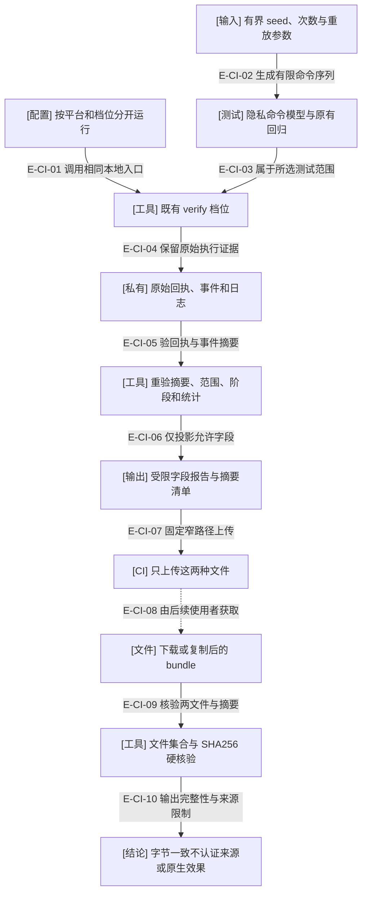

# CI 与定向模型：保存可重放输入，限制对外输出

当前 workflow 已配置 gate/artifact × Ubuntu 24.04/macOS 15，使用明确的 Node/npm 和完整 Action 提交身份。配置与本地静态测试已存在，远端矩阵尚未执行；不能由一台 macOS 的通过推断其他平台。

### 本图术语说明

| 术语 | 含义 |
| --- | --- |
| 定向命令模型 | 仅跟踪输入是否引入凭证、opaque 或私有定位器，不复制生产正则/位置算法。组合添加、格式化、白名单与重置操作。 |
| 可重放 | 默认 seed 20261003、200 条序列、每条最多24步；失败日志保留 seed/path/replayPath 和缩减样本。 |
| 原始证据 | 仍位于私有 verification 目录；case 名和错误等可能含路径，不直接上传。 |
| 受限字段 | 分类、版本/平台、时间、摘要、计数、受限相对测试路径与模型 seed/次数；任意字段及计数键不透传。 |
| bundle | report.json 与 manifest.json；完整性通过和报告中的 verificationStatus 分开，origin 始终 unverified。 |

### 本图边级证据

| 编号 | 代码或配置证据 | 测试证据 |
| --- | --- | --- |
| E-CI-01 | `.github/workflows/verify.yml` 的平台/档位矩阵调用 wf verify，不触发真实聊天或发布。 | `tests/tooling/verification/ci-workflow.test.ts#parseDocument`（静态检查，非远端执行） |
| E-CI-02 | `tooling/testing/model-options.ts#modelTestOptions` 与测试 owner 的命令数组。 | `tests/kernel/privacy-model.test.ts#TextCommand` / `tests/tooling/verification/ci-workflow.test.ts#modelTestOptions` |
| E-CI-03 | `tooling/testing/fault-suites.ts#listFaultSuites` 将模型加入 privacy 组；全门仍由源清单收集。 | `tests/tooling/testing/fault-suites.test.ts#listFaultSuites` |
| E-CI-04 | `tooling/verification/verify.ts#verifyRepository` 留下日志、模型选项与身份。 | `tests/tooling/verification/verify.test.ts#verifyRepository` |
| E-CI-05 | `tooling/verification/export-ci.ts#exportCiVerification` 重验事件哈希/统计与通过所需阶段。 | `tests/tooling/verification/verify.test.ts#exportCiVerification` |
| E-CI-06 | exportCiVerification 使用 publicCounts/modelSummary 与受限字段，不扩散任意键。 | `tests/tooling/verification/verify.test.ts#exportCiVerification`（含伪造私有计数键） |
| E-CI-07 | workflow 的 upload 路径仅限 report 和 manifest，失败时也尝试保留结果。 | `tests/tooling/verification/ci-workflow.test.ts#parseDocument` |
| E-CI-08 | 这是后续使用者的复制/下载步骤；没有脚本自动认证此来源。 | 未覆盖：当前没有远端下载作业执行证据。 |
| E-CI-09 | `tooling/verification/export-ci.ts#verifyCiBundle` 拒绝额外文件或摘要不符。 | `tests/tooling/verification/verify.test.ts#verifyCiBundle` |
| E-CI-10 | verifyCiBundle 分开返回 integrity、verificationStatus 与 origin。 | `tests/tooling/verification/verify.test.ts#verifyCiBundle` |

## 不应被合并的结论

固定故障矩阵现在选择15份源测试，包含纯决定/文本、注入错误、真实文件系统与子进程案例；不能把整组称为统一 fsync 或真实 OS 权限试验。模型经过真实扫描器，但不是原生宿主证据。

CI 不要求宿主登录，权限为 contents:read，checkout 不保留凭证；纯验证可以取消。工作流没有自动发布、安装缓存或原生聊天调用。Windows 未进入完整矩阵；独立图谱保持自己的检查，不接入根 workspace 或运行时依赖。

报告的 commit 是基线，内容 digest 标识实际输入；不可仅凭 commit 推定本地检出干净。报告没有签名，不声称供应链等级。原生业务接受仍由 Wakeflow review 协议和实际宿主证据负责。

[完整验证流程](./maintainer-verification.md) · [维护使用说明与官方版本来源](../../../docs/references/maintainer-tools.md) · [本轮验证来源](../../plans/review-2026-10-03-maintainer-tools/validation-provenance.md)
