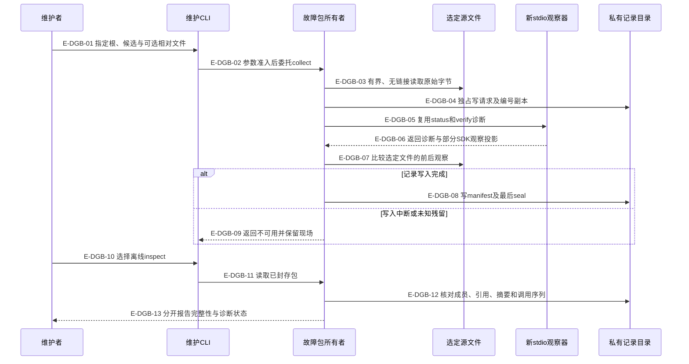

# 只读故障包：原始材料、诊断和分享分别负责什么

`doctor collect`保留明确选取的源文件与一次新stdio诊断；`inspect`检查本地材料的一致性；`export`另建一个封闭分享摘要。原始文件、SDK投影、工作区健康、宿主激活和Controller接受是不同事实，故障包不拥有业务状态。

## 采集与中断边界

### 本图术语说明

| 术语 | 含义 |
| --- | --- |
| 选定源文件 | 自动选配置与候选清单，另接受最多32份工作区相对文件；附件复制不递归发现日志或读取宿主数据库。原status/verify仍按自己的规则检查。 |
| 原始字节 | 无效UTF8、损坏JSON、原换行都不转换；诊断可能失败，副本仍可保存。 |
| SDK观察投影 | `withLabMcp`保留的工具结果/安全错误类别，不是原始传输字节、任意stderr或原生聊天回执。 |
| seal | 最后写入的私有完成标记；结构完成不等于所有源可读或工作区健康。 |
| 离线 | 原工作区和候选可以已经移除；只复验包中的字节与声明，不补写缺失项。 |

### 本图边级证据

| 编号 | 代码证据 | 测试证据 |
| --- | --- | --- |
| E-DGB-01 | `tooling/cli.ts#runDoctorCommand`要求root/candidate，只另接受files。 | `tests/tooling/diagnostics/bundle.test.ts#runToolingCli` |
| E-DGB-02 | `tooling/diagnostics/bundle.ts#collectDiagnosticBundle`拒绝重复、越界与输出根重叠。 | `tests/tooling/diagnostics/bundle.test.ts#collectDiagnosticBundle` |
| E-DGB-03 | `tooling/diagnostics/bundle.ts#copySources`调用 `tooling/capture/io.ts#readObservedFile`，每份4MiB、总源32MiB。 | `tests/tooling/diagnostics/bundle.test.ts#collectDiagnosticBundle`（二进制、链接、硬链接与预算） |
| E-DGB-04 | `tooling/capture/io.ts#writeExclusive` / writeExclusiveJson为wx与fsync。 | 间接覆盖：`tests/tooling/diagnostics/bundle.test.ts#collectDiagnosticBundle`比较原字节和权限。 |
| E-DGB-05 | `tooling/diagnostics/workspace.ts#inspectWorkspaceWithObservations`委托diagnoseWorkspace及 `tooling/lab/mcp-session.ts#withLabMcp`。 | 间接覆盖：`tests/tooling/diagnostics/bundle.test.ts#collectDiagnosticBundle`核对两种只读调用及真实树零写。 |
| E-DGB-06 | 同一诊断owner在失败时保留已核验候选，返回同一次调用收集的部分observations。 | `tests/tooling/diagnostics/bundle.test.ts#readDiagnosticBundle`（第二次观察失败及取消） |
| E-DGB-07 | `tooling/diagnostics/bundle.ts#recheck`比较原节点和摘要；取消时保留未复查。 | `tests/tooling/diagnostics/bundle.test.ts#collectDiagnosticBundle`（同字节替换与取消） |
| E-DGB-08 | collectDiagnosticBundle独占写bundle.json与ready.json，然后实际回读。 | `tests/tooling/diagnostics/bundle.test.ts#readDiagnosticBundle` |
| E-DGB-09 | 同一owner返回bundleSealed:false，保留未识别的写入残留。 | `tests/tooling/diagnostics/bundle.test.ts#inspectDiagnosticBundle`（最后seal发布失败） |
| E-DGB-10 | `tooling/cli.ts#runDoctorCommand`在id和input间互斥选择。 | `tests/tooling/diagnostics/bundle.test.ts#runToolingCli` |
| E-DGB-11 | `tooling/diagnostics/bundle.ts#inspectDiagnosticBundle`委托离线读取。 | `tests/tooling/diagnostics/bundle.test.ts#inspectDiagnosticBundle` |
| E-DGB-12 | `tooling/diagnostics/bundle.ts#readDiagnosticBundle`核对精确清单、摘要、status→verify顺序及通过诊断的两次成功记录。 | `tests/tooling/diagnostics/bundle.test.ts#readDiagnosticBundle`、`tests/tooling/diagnostics/bundle.test.ts#inspectDiagnosticBundle` |
| E-DGB-13 | inspector的matched与diagnosisStatus分开，来源保持local-unsigned-record。 | `tests/tooling/diagnostics/bundle.test.ts#inspectDiagnosticBundle`（失败诊断仍可复验） |

采集不是事务快照。`collection.coherent`只表示选定源在前后两次采样中节点和字节相同，并且探测记录未因8MiB预算被略去；不覆盖全部文件，也不证明期间从未改变再恢复。读文件错误与写私有目录失败分开，未知残留不被自动收编或清理。

## 分享与离线校验

### 本图术语说明

| 术语 | 含义 |
| --- | --- |
| 值类别 | 已知门名或other；状态枚举、数字、布尔、摘要及严格时间。任意code、owner、版本后缀和原文没有复制路径。 |
| 成功前提 | 两次成功调用、零失败调用、候选信息、两次观测时刻、候选/配置匹配且无截断；自摘要不能补足缺项。 |
| 本地分享摘要 | 显式生成的独立JSON；不会上传，也不包含原始文件、路径、私有标识或任意stderr。 |
| 来源未验证 | SHA-256只核对字节和声明，不能认证采集者、宿主激活或业务接受。 |

### 本图边级证据

| 编号 | 代码证据 | 测试证据 |
| --- | --- | --- |
| E-DGS-01 | `tooling/diagnostics/public-summary.ts#exportDiagnosticSummary`先调用readDiagnosticBundle。 | `tests/tooling/diagnostics/bundle.test.ts#exportDiagnosticSummary` |
| E-DGS-02 | `tooling/diagnostics/public-summary.ts#publicBody`重建每个字段，未知门归other；候选摘要显式命名。 | 间接覆盖：`tests/tooling/diagnostics/bundle.test.ts#exportDiagnosticSummary`注入合法小写私有字符串及verified声明。 |
| E-DGS-03 | `tooling/diagnostics/public-summary.ts#validateSummary`检查Schema、源计数、调用计数与完整成功条件。 | `tests/tooling/diagnostics/bundle.test.ts#inspectDiagnosticSummary`（重算checksum后仍拒绝0次成功、缺候选和时间） |
| E-DGS-04 | exportDiagnosticSummary用writeExclusiveJson写独立随机文件，不改私有包。 | `tests/tooling/diagnostics/bundle.test.ts#exportDiagnosticSummary` |
| E-DGS-05 | `tooling/diagnostics/public-summary.ts#inspectDiagnosticSummary`有界读取128KiB并严格解码。 | `tests/tooling/diagnostics/bundle.test.ts#runToolingCli`、`tests/tooling/diagnostics/bundle.test.ts#inspectDiagnosticSummary` |
| E-DGS-06 | validateSummary拒绝未知字段、错误摘要、矛盾计数和伪造的已验证来源。 | `tests/tooling/diagnostics/bundle.test.ts#inspectDiagnosticSummary` |

实际发现过一个一致性缺口：旧校验接受“diagnosisStatus为passed，但callsSucceeded为0”的自校验摘要。使用实际导出文件复现后，补齐调用、候选和观测时间前提；修前与修后结果分别保留在[本轮证据](../../plans/review-2026-10-04-diagnostic-bundles/validation-provenance.md)。这不会让校验变成来源认证。

## 两个现场假设的修正

候选宿主由维护者明确选择。Claude观察器用于Codex初始化的lab时，host-settings-assets/local-layout等门正确报告不匹配；各自初始化的两种lab都通过。该差异来自已有宿主profile，工具不另写一套自动切换或修复规则。

`.wakeflow-local`中的额外普通文件不一定非法；本轮先前夹具依赖默认umask生成0644，真正触发的是权限漂移。`src/workspace/maintenance/wakeflow-private-mode-census.ts#inspectWakeflowPrivateModes`和 `src/foundation/filesystem/private-mode-convergence.ts#classifyPrivateNode`要求私有目录0700、文件0600。回归改成明确构造0600的通过与0644的失败，并确认采集后模式未被修复。覆盖见 `tests/tooling/diagnostics/workspace.test.ts#chmodSync`、`tests/tooling/diagnostics/bundle.test.ts#chmodSync`；其他保留目录的未知条目仍由各自owner规则判断。

[命令用法](../../../docs/references/maintainer-tools.md) · [安装与运行身份](./installation-and-runtime-identity.md) · [静态依赖](./file-dependencies.md) · [本轮验证](../../plans/review-2026-10-04-diagnostic-bundles/validation-provenance.md)
