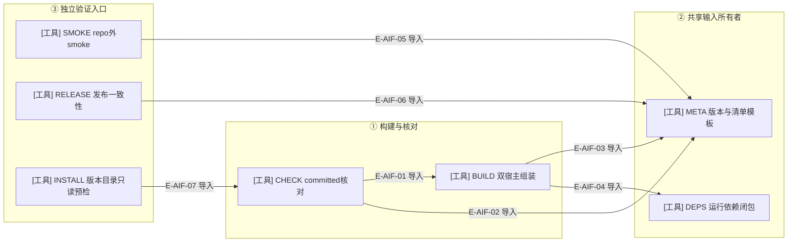

# 制品工具的直接导入与构建期装载

这张精选图只列手写工具文件之间的真实静态import。它不把命令行先后、文件输入输出或固定路径的动态import画成静态依赖。Schema生成器、测试runner与架构命令没有本图中的本地工具import边，单列在图后。

### 本图术语说明

| 术语 | 含义 |
| --- | --- |
| 静态import | TypeScript文件中直接声明的本地模块依赖；不表示此命令每次一定运行另一个命令。 |
| committed核对 | 调用构建函数产生候选，再核对plugins；不修改committed目标。 |
| 独立验证 | smoke与release不是build函数中的自动后续步骤；各自有明确命令入口。 |
| 元数据 | 唯一版本输入、宿主manifest/package/marketplace形状与Node范围；不是需求状态权威。 |

### 文件与符号定位

| 节点 | 文件 / 符号 | 职责 |
| --- | --- | --- |
| CHECK | `tooling/artifacts/check-plugin-artifacts.ts#checkWakeflowPluginArtifacts` | 新候选与committed字节/模式/清单及marketplace检查。 |
| BUILD | `tooling/artifacts/build-plugin-artifacts.ts#buildWakeflowPluginArtifacts` | 编译闭包、宿主渲染、依赖、stage和manifest组装。 |
| META | `tooling/artifacts/plugin-metadata.ts#readReleaseVersion` | 版本来源与宿主静态元数据。 |
| DEPS | `tooling/artifacts/plugin-dependency-closure.ts#resolveRuntimeDependencyClosure` | lock与安装版本求解、vendored文件。 |
| SMOKE | `tooling/artifacts/smoke-plugin-artifacts.ts#smokeWakeflowPluginArtifacts` | repo外制品MCP/hook及一次性工作区验证。 |
| RELEASE | `tooling/release/check-release-consistency.ts#checkWakeflowReleaseConsistency` | 版本/Node/manifest/Git发布一致性。 |
| INSTALL | `tooling/artifacts/inspect-local-installation.ts#inspectLocalInstallation` | 完整核验候选与已有目录；拒绝同版本不同字节，不安装。 |

### 本图边级证据

| 编号 | 直接import证据 | 测试证据 |
| --- | --- | --- |
| E-AIF-01 | CHECK 导入 buildWakeflowPluginArtifacts；调用时仅给candidateRoot。 | `tests/artifacts/plugin-artifact-check.test.ts#checkWakeflowPluginArtifacts` |
| E-AIF-02 | CHECK 导入readReleaseVersion、目录名和两个expectedMarketplaceEntry。 | `tests/artifacts/plugin-artifact-check.test.ts#checkMarketplaces` |
| E-AIF-03 | BUILD 导入readReleaseVersion、renderPackageJson、renderPluginManifest等。 | `tests/artifacts/plugin-artifacts.test.ts#readReleaseVersion` |
| E-AIF-04 | BUILD 导入resolveRuntimeDependencyClosure与collectVendoredFiles。 | `tests/artifacts/plugin-dependency-closure.test.ts#collectVendoredFiles` |
| E-AIF-05 | SMOKE 仅从META导入pluginDirectoryName，未静态导入BUILD或CHECK。 | `tests/artifacts/plugin-artifact-smoke.manual.ts#smokeWakeflowPluginArtifacts` |
| E-AIF-06 | RELEASE导入统一版本解析、Node范围和宿主目录/manifest名称。 | `tests/release/check-release-consistency.test.ts#checkWakeflowReleaseConsistency` |
| E-AIF-07 | INSTALL直接导入CHECK的verifyArtifactAgainstManifest；不调用其整组重建入口。 | `tests/artifacts/immutable-local-installation.test.ts#inspectLocalInstallation` |

### 必须与静态图分开的三类关系

| 关系 | 真实生产者 → 消费者 | 定位与限制 |
| --- | --- | --- |
| 构建期动态host装载 | 两个hook/profile、MCP配置、agent-text模块 → BUILD | `tooling/artifacts/build-plugin-artifacts.ts#CANDIDATES` 固定module与export名字，importCompiledHostModule从编译路径加载；不是源码静态import边。 |
| 编译文件闭包 | 每宿主MCP入口、共享hook入口 → BUILD | `tooling/artifacts/build-plugin-artifacts.ts#candidateClosure` 用es-module-lexer读取编译JS依赖；只允许对端两profile，hook闭包禁止hosts。 |
| 制品内动态读取 | 已生成catalog/layout模块 → SMOKE | `tooling/artifacts/smoke-plugin-artifacts.ts#expectedToolNames` 与 hookObservationsDirectory 在被复制制品中import；不偷用源码目录的工具表或路径。 |

构建期host provider的实际源文件是：

- `src/hosts/codex/codex-hook-fragment.ts#renderCodexHooksJson`、`src/hosts/claude-code/claude-code-hook-fragment.ts#renderClaudeCodeHooksJson`。
- `src/hosts/codex/codex-process-launch-profile.ts#CODEX_MCP_CONFIGURATION`、`src/hosts/claude-code/claude-code-mcp-configuration.ts#CLAUDE_CODE_MCP_CONFIGURATION`。
- `src/hosts/codex/codex-agent-text-profile.ts#renderCodexAgentText`、`src/hosts/claude-code/claude-code-agent-text-profile.ts#renderClaudeCodeAgentText`。

这些固定装载点与对端profile例外都被构建函数明确列出，没有通用的插件handler registry。

### 独立工具入口与命令编排

| 文件 / 符号 | 实际本地输入输出 | 与上图的连接方式 |
| --- | --- | --- |
| `tooling/codegen/schema-types.ts#buildSchemaTypes` / checkSchemaTypes | schemas → generated或.build候选 | root npm脚本调用；不静态import BUILD。 |
| `tooling/testing/run-typescript-tests.ts#compiledTypeScriptTests` 与 resolveTestConcurrency | 当前tests源 → 已有.build/tests输出；环境变量 → 文件worker预算 | root npm脚本先编译再运行；不枚举旧编译残留；并发覆盖不改变选中清单。 |
| `tooling/architecture/check-dependencies.ts#run` | src/tests/tooling → dependency-cruiser报告 | root npm脚本执行；六层规则来自.dependency-cruiser.cjs。 |

测试runner的晚变更没有新增本地import边：`tooling/testing/run-typescript-tests.ts#run` 读取WAKEFLOW_TEST_CONCURRENCY并交 `tooling/testing/run-typescript-tests.ts#resolveTestConcurrency`，再把结果放入Node的 --test-concurrency 参数。缺省/空值仍用availableParallelism；显式值可降低到1，但不能超过可用并行度，非法文本直接失败。纯函数准入断言见 `tests/tooling/testing/run-typescript-tests.test.ts#resolveTestConcurrency`；文件清单与耗时排序仍由原函数负责。

当前工具共10份，本轮与 rc.3 语义审阅对应的字节一致，按相同 SHA 继承；inspect-local-installation 属于既有工具，不重复记作本轮新增文件。记录见[当前索引](../02-file-review-index.md)。这里的静态图是精选结构证据，必须与 [制品组装](./README.md) 和 [Schema/验证边界](./schema-and-validation.md) 一起阅读。没有自动部署或缓存刷新分支。
