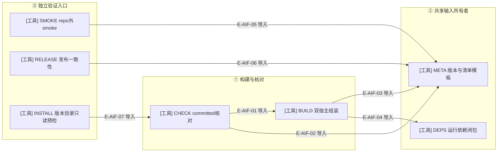
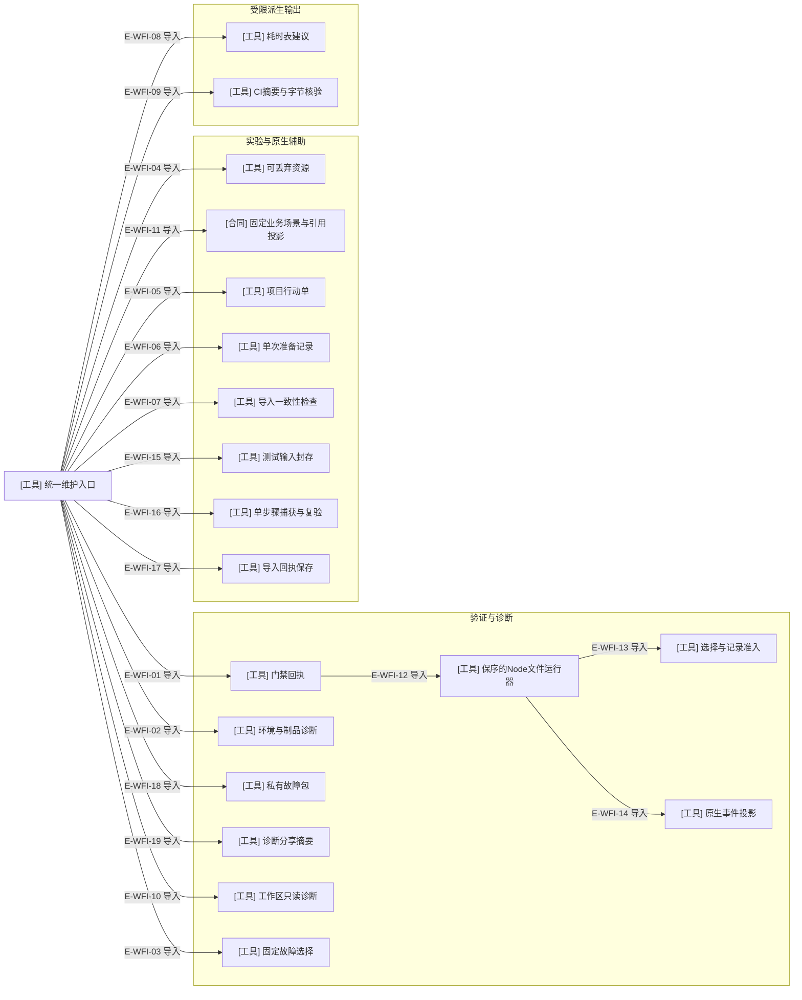

# 制品工具的直接导入与构建期装载

这张精选图只列手写工具文件之间的真实静态import。它不把命令行先后、文件输入输出或固定路径的动态import画成静态依赖。第一图保留构建工具的精选关系；第二图补充维护 CLI 的直接依赖。测试运行器现在直接依赖记录模块，另有按路径装载的 reporter，二者不能混为同一类边。

### 本图术语说明

| 术语 | 含义 |
| --- | --- |
| 静态import | TypeScript文件中直接声明的本地模块依赖；不表示此命令每次一定运行另一个命令。 |
| committed核对 | 调用构建函数产生候选，再核对plugins；不修改committed目标。 |
| 独立验证 | smoke与release不是build函数中的自动后续步骤；各自有明确命令入口。 |
| 元数据 | 唯一版本输入、宿主manifest/package/marketplace形状与Node范围；不是需求状态权威。 |

### 文件与符号定位

| 节点 | 文件 / 符号 | 职责 |
| --- | --- | --- |
| CHECK | `tooling/artifacts/check-plugin-artifacts.ts#checkWakeflowPluginArtifacts` | 新候选与committed字节/模式/清单及marketplace检查。 |
| BUILD | `tooling/artifacts/build-plugin-artifacts.ts#buildWakeflowPluginArtifacts` | 编译闭包、宿主渲染、依赖、stage和manifest组装。 |
| META | `tooling/artifacts/plugin-metadata.ts#readReleaseVersion` | 版本来源与宿主静态元数据。 |
| DEPS | `tooling/artifacts/plugin-dependency-closure.ts#resolveRuntimeDependencyClosure` | lock与安装版本求解、vendored文件。 |
| SMOKE | `tooling/artifacts/smoke-plugin-artifacts.ts#smokeWakeflowPluginArtifacts` | repo外制品MCP/hook及一次性工作区验证。 |
| RELEASE | `tooling/release/check-release-consistency.ts#checkWakeflowReleaseConsistency` | 版本/Node/manifest/Git发布一致性。 |
| INSTALL | `tooling/artifacts/inspect-local-installation.ts#inspectLocalInstallation` | 完整核验候选与已有目录；拒绝同版本不同字节，不安装。 |

### 本图边级证据

| 编号 | 直接import证据 | 测试证据 |
| --- | --- | --- |
| E-AIF-01 | CHECK 导入 buildWakeflowPluginArtifacts；调用时仅给candidateRoot。 | `tests/artifacts/plugin-artifact-check.test.ts#checkWakeflowPluginArtifacts` |
| E-AIF-02 | CHECK 导入readReleaseVersion、目录名和两个expectedMarketplaceEntry。 | `tests/artifacts/plugin-artifact-check.test.ts#checkMarketplaces` |
| E-AIF-03 | BUILD 导入readReleaseVersion、renderPackageJson、renderPluginManifest等。 | `tests/artifacts/plugin-artifacts.test.ts#readReleaseVersion` |
| E-AIF-04 | BUILD 导入resolveRuntimeDependencyClosure与collectVendoredFiles。 | `tests/artifacts/plugin-dependency-closure.test.ts#collectVendoredFiles` |
| E-AIF-05 | SMOKE 仅从META导入pluginDirectoryName，未静态导入BUILD或CHECK。 | `tests/artifacts/plugin-artifact-smoke.manual.ts#smokeWakeflowPluginArtifacts` |
| E-AIF-06 | RELEASE导入统一版本解析、Node范围和宿主目录/manifest名称。 | `tests/release/check-release-consistency.test.ts#checkWakeflowReleaseConsistency` |
| E-AIF-07 | INSTALL直接导入CHECK的verifyArtifactAgainstManifest；不调用其整组重建入口。 | `tests/artifacts/immutable-local-installation.test.ts#inspectLocalInstallation` |

### 必须与静态图分开的三类关系

| 关系 | 真实生产者 → 消费者 | 定位与限制 |
| --- | --- | --- |
| 构建期动态host装载 | 两个hook/profile、MCP配置、agent-text模块 → BUILD | `tooling/artifacts/build-plugin-artifacts.ts#CANDIDATES` 固定module与export名字，importCompiledHostModule从编译路径加载；不是源码静态import边。 |
| 编译文件闭包 | 每宿主MCP入口、共享hook入口 → BUILD | `tooling/artifacts/build-plugin-artifacts.ts#candidateClosure` 用es-module-lexer读取编译JS依赖；只允许对端两profile，hook闭包禁止hosts。 |
| 制品内动态读取 | 已生成catalog/layout模块 → SMOKE | `tooling/artifacts/smoke-plugin-artifacts.ts#expectedToolNames` 与 hookObservationsDirectory 在被复制制品中import；不偷用源码目录的工具表或路径。 |

构建期host provider的实际源文件是：

- `src/hosts/codex/codex-hook-fragment.ts#renderCodexHooksJson`、`src/hosts/claude-code/claude-code-hook-fragment.ts#renderClaudeCodeHooksJson`。
- `src/hosts/codex/codex-process-launch-profile.ts#CODEX_MCP_CONFIGURATION`、`src/hosts/claude-code/claude-code-mcp-configuration.ts#CLAUDE_CODE_MCP_CONFIGURATION`。
- `src/hosts/codex/codex-agent-text-profile.ts#renderCodexAgentText`、`src/hosts/claude-code/claude-code-agent-text-profile.ts#renderClaudeCodeAgentText`。

这些固定装载点与对端profile例外都被构建函数明确列出，没有通用的插件handler registry。

### 独立工具入口与命令编排

| 文件 / 符号 | 实际本地输入输出 | 与上图的连接方式 |
| --- | --- | --- |
| `tooling/codegen/schema-types.ts#buildSchemaTypes` / checkSchemaTypes | schemas → generated或.build候选 | root npm脚本调用；不静态import BUILD。 |
| `tooling/testing/run-typescript-tests.ts#compiledTypeScriptTests` 与 resolveTestConcurrency | 当前tests源 → 已有.build/tests输出；环境变量 → 文件worker预算 | root npm脚本先编译再运行；不枚举旧编译残留；并发覆盖不改变选中清单。 |
| `tooling/architecture/check-dependencies.ts#run` | src/tests/tooling → dependency-cruiser报告 | root npm脚本执行；六层规则来自.dependency-cruiser.cjs。 |

测试运行器现在静态导入 test-recording 与 test-event-reporter，通过官方 node:test.run 保留排程顺序，并将同一事件流送到终端和结构化记录。旧CLI的文件参数被Node重新排序，实际顺序曾与选择记录不同；本轮以真实进程回归复现并修复。覆盖见 `tests/tooling/testing/test-schedule-order.test.ts#spawnSync` 与 `tests/tooling/testing/test-recording.test.ts#inspectTestRecording`。

原有构建、Schema和检查入口为10份；当前整个tooling为47份。本轮复核2新增、2修改及I/O新消费者边界，共5文件，其余按相同SHA和原始语义记录继承；inspect-local-installation 仍是既有工具。记录见[当前索引](../02-file-review-index.md)。这里的静态图是精选结构证据，必须与 [制品组装](./README.md) 和 [Schema/验证边界](./schema-and-validation.md) 一起阅读。没有自动部署或缓存刷新分支。

## 统一维护入口的精选直接依赖

### 本图术语说明

| 术语 | 含义 |
| --- | --- |
| 统一入口 | 只验证命令参数并分发，不增添第二套 Controller。 |
| 原生辅助 | 生成计划、记录准备尝试、核对导入字段；不执行 create_thread 或聊天投递。 |
| 派生输出 | 耗时建议和受限 CI 报告；都不自动修改业务权威或发布版本。 |
| 精选直接依赖 | 省略共享文件工具、错误类型及各 owner 内部依赖；完整原始图另附。 |

### 文件与符号定位

| 节点 | 文件 / 符号 | 职责 |
| --- | --- | --- |
| WFCAPPLAN | `tooling/capture/plan.ts#prepareCapture` | 既有合同、配置与文件副本封存。 |
| WFCAPRUN | `tooling/capture/run.ts#runCapture` | 单步命令及原始日志，不判测试验收。 |
| WFRCP | `tooling/live/receipt.ts#captureHostReceipt` | 请求/返回原始字节与两种摘要。 |
| WFBUNDLE | `tooling/diagnostics/bundle.ts#collectDiagnosticBundle` | 明确源字节、观察投影和私有封存。 |
| WFSHARE | `tooling/diagnostics/public-summary.ts#exportDiagnosticSummary` | 重建封闭公开摘要及离线一致性检查。 |
| WFCLI | `tooling/cli.ts#runToolingCli` | 命令分发与退出投影。 |
| WFVERIFY | `tooling/verification/verify.ts#verifyRepository` | 阶段、进程和证据结算。 |
| WFDOC | `tooling/diagnostics/doctor.ts#inspectArtifactInstallation` | 分域只读诊断。 |
| WFWORKSPACE | `tooling/diagnostics/workspace.ts#inspectWorkspace` | 新观察进程的工作区诊断。 |
| WFFAULT | `tooling/testing/fault-suites.ts#runFaultSuite` | 明确回归选择。 |
| WFLAB | `tooling/lab/lab.ts#createLab` | 资源创建、检查、运行和清理。 |
| WFSCENARIOS | `tooling/lab/workflow-context.ts#BUSINESS_SCENARIOS` | 场景名闭集与结果引用载体。 |
| WFPLAN | `tooling/live/plan.ts#planLiveProject` | 消费当前宿主说明生成计划。 |
| WFATT | `tooling/live/attempts.ts#recordLiveAttempt` | 准备记录与重复拒绝。 |
| WFEVI | `tooling/live/evidence.ts#verifyLiveEvidence` | 关联字段检查，原生仍未知。 |
| WFTIME | `tooling/testing/test-duration-report.ts#proposeTestDurations` | 完整同输入回执生成建议。 |
| WFCI | `tooling/verification/export-ci.ts#exportCiVerification` | 受限导出与bundle核验。 |
| WFTESTS | `tooling/testing/run-typescript-tests.ts#run` | 真实保序派发及并发预算。 |
| WFRECORD | `tooling/testing/test-recording.ts#prepareTestRecording` | 封闭选择与记录目录。 |
| WFEVENTS | `tooling/testing/test-event-reporter.ts#testEventReporter` | 事件投影与结束标记。 |

### 本图边级证据

| 编号 | 直接 import 证据 | 测试证据 |
| --- | --- | --- |
| E-WFI-01 | CLI直接导入 verifyRepository。 | `tests/tooling/verification/verify.test.ts#verifyRepository` |
| E-WFI-02 | CLI直接导入两种诊断函数。 | `tests/tooling/diagnostics/doctor.test.ts#inspectArtifactInstallation` |
| E-WFI-03 | CLI直接导入 listFaultSuites/runFaultSuite。 | 间接覆盖：`tests/tooling/testing/fault-suites.test.ts#listFaultSuites` 核对清单；有效run另有实际CLI记录。 |
| E-WFI-04 | CLI直接导入四个lab操作。 | `tests/tooling/lab/lab.test.ts#createLab` |
| E-WFI-05 | CLI直接导入计划函数。 | `tests/tooling/live/live.test.ts#planLiveProject` |
| E-WFI-06 | CLI直接导入尝试记录函数。 | `tests/tooling/live/live.test.ts#recordLiveAttempt` |
| E-WFI-07 | CLI直接导入文件证据检查函数。 | `tests/tooling/live/live.test.ts#verifyLiveEvidence` |
| E-WFI-08 | CLI直接导入耗时建议函数。 | `tests/tooling/verification/verify.test.ts#proposeTestDurations` |
| E-WFI-09 | CLI直接导入导出与bundle检查函数。 | `tests/tooling/verification/verify.test.ts#exportCiVerification` |
| E-WFI-10 | CLI直接导入 inspectWorkspace。 | `tests/tooling/diagnostics/workspace.test.ts#inspectWorkspace` |
| E-WFI-11 | CLI直接导入 BUSINESS_SCENARIOS 和类型。 | `tests/tooling/lab/workflow.test.ts#BUSINESS_SCENARIOS` |
| E-WFI-12 | verify直接导入 resolveTestConcurrency。 | `tests/tooling/testing/run-typescript-tests.test.ts#resolveTestConcurrency` |
| E-WFI-13 | 运行器直接导入 prepareTestRecording。 | `tests/tooling/testing/test-recording.test.ts#prepareTestRecording` |
| E-WFI-14 | 运行器直接导入默认事件reporter。 | 间接覆盖：`tests/tooling/testing/test-recording.test.ts#runLoggedCommand` 运行真实进程并校验记录。 |
| E-WFI-15 | CLI直接导入 prepareCapture。 | `tests/tooling/capture/capture.test.ts#prepareCapture` |
| E-WFI-16 | CLI直接导入 runCapture/inspectCapture。 | `tests/tooling/capture/capture.test.ts#runCapture`、`tests/tooling/capture/capture.test.ts#inspectCapture` |
| E-WFI-17 | CLI直接导入 captureHostReceipt。 | `tests/tooling/live/receipt.test.ts#captureHostReceipt` |
| E-WFI-18 | CLI直接导入 collectDiagnosticBundle/inspectDiagnosticBundle。 | `tests/tooling/diagnostics/bundle.test.ts#collectDiagnosticBundle`、`tests/tooling/diagnostics/bundle.test.ts#inspectDiagnosticBundle` |
| E-WFI-19 | CLI直接导入 exportDiagnosticSummary/inspectDiagnosticSummary。 | `tests/tooling/diagnostics/bundle.test.ts#exportDiagnosticSummary`、`tests/tooling/diagnostics/bundle.test.ts#inspectDiagnosticSummary` |

内部关系另见[维护验证调用](./maintainer-verification.md)、[实验与行动单](./lab-and-live-tools.md)、[固定业务实验](./lab-business-scenarios.md)、[CI与模型](./ci-and-model-evidence.md)。本轮[完整静态导入库存](../../plans/review-2026-10-04-diagnostic-bundles/import-graph.json)包含502个模块、3474条本地导入；库存不等于所有边已逐行审查。

新增入口的调用、标记残留和授权边界见[测试捕获与回执](./test-capture-and-receipts.md)。

故障包和分享的实际调用与中断边界见[只读诊断包](./diagnostic-bundles.md)。静态依赖不表示CLI自动采集所有材料或上传。
