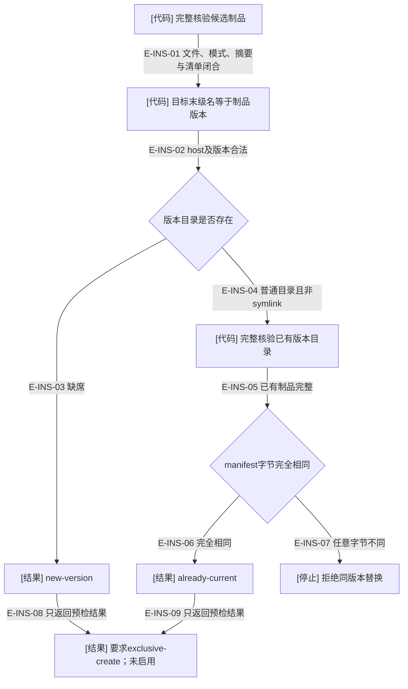
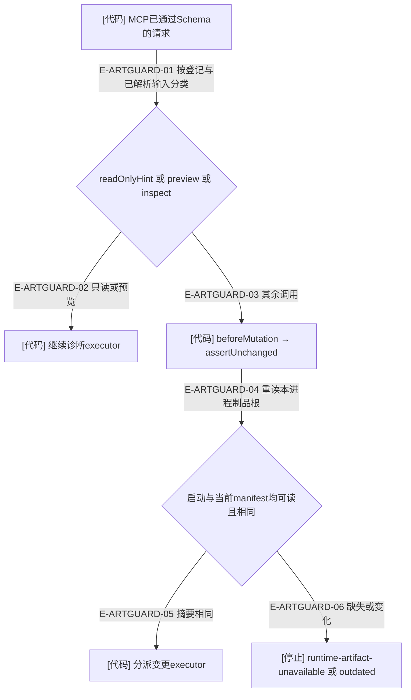

# 安装预检与运行进程：两处不同的身份边界

当前版本输入为 `1.1.0-rc.5` 源码候选，不证明安装目录或运行会话已采用它。插件版本、配置/锁/观察合同编号各有自己的用途；当前配置和锁编号2不构成旧目录迁移承诺。

## 安装目录的只读预检

### 本图术语说明

| 术语 | 含义 |
| --- | --- |
| 完整核验 | verifyArtifactAgainstManifest比对文件集合、大小、摘要与模式；不能只比较版本字符串。 |
| exclusive-create | 后续真正安装器需要独占发布到新目录；预检没有预留目录，不保证之后仍缺席。 |
| already-current | 两个完整制品清单字节相同；不证明宿主选择它，也不证明运行进程已加载它。 |

### 本图边级证据

| 编号 | 代码证据 | 测试证据 | 边界 |
| --- | --- | --- | --- |
| E-INS-01 | `tooling/artifacts/check-plugin-artifacts.ts#verifyArtifactAgainstManifest` | `tests/artifacts/plugin-artifact-check.test.ts#verifyArtifactAgainstManifest` | 候选先完整核验。 |
| E-INS-02 | `tooling/artifacts/inspect-local-installation.ts#inspectLocalInstallation` | `tests/artifacts/immutable-local-installation.test.ts#inspectLocalInstallation` | 目标版本名不符直接拒绝。 |
| E-INS-03 | `tooling/artifacts/inspect-local-installation.ts#inspectLocalInstallation` 中的lstatSync观察 | `tests/artifacts/immutable-local-installation.test.ts#inspectLocalInstallation`（断言new-version；不创建目标的性质来自源码，未单独断言零写） | 首次预检不创建目标。 |
| E-INS-04 | `tooling/artifacts/inspect-local-installation.ts#inspectLocalInstallation` | 未覆盖：该测试未独立构造目标symlink负例；代码明确拒绝非普通目录。 | 不跟随目标符号链接。 |
| E-INS-05 | `tooling/artifacts/check-plugin-artifacts.ts#verifyArtifactAgainstManifest` | `tests/artifacts/plugin-artifact-check.test.ts#verifyArtifactAgainstManifest` | 已有目录同样完整核验。 |
| E-INS-06 | `tooling/artifacts/inspect-local-installation.ts#inspectLocalInstallation` | `tests/artifacts/immutable-local-installation.test.ts#inspectLocalInstallation` | 相同字节返回already-current。 |
| E-INS-07 | `tooling/artifacts/inspect-local-installation.ts#inspectLocalInstallation` | `tests/artifacts/immutable-local-installation.test.ts#inspectLocalInstallation` | 拒绝后原目录清单字节保持。 |
| E-INS-08 | `tooling/artifacts/inspect-local-installation.ts#inspectLocalInstallation` | `tests/artifacts/immutable-local-installation.test.ts#inspectLocalInstallation` | activation为not-performed。 |
| E-INS-09 | `tooling/artifacts/inspect-local-installation.ts#inspectLocalInstallation` | `tests/artifacts/immutable-local-installation.test.ts#inspectLocalInstallation` | 不执行安装或宿主启用。 |

## 运行进程的变更分派门

### 本图术语说明

| 术语 | 含义 |
| --- | --- |
| 启动摘要 | 当前进程启动时固定的manifest字节摘要；不会随磁盘变更自动更新。 |
| 分派门 | 真实生成MCP组合根注入的beforeMutation；源测试根无清单时可用，不泛化为所有直接库调用受此门保护。 |
| 清单检查 | 观察同一位置的manifest；不能证明所有加载模块未被替换、宿主选中的兄弟版本或技能已重载。 |

### 本图边级证据

| 编号 | 代码证据 | 测试证据 | 关系与限制 |
| --- | --- | --- | --- |
| E-ARTGUARD-01 | `src/entrypoints/wakeflow-public-mcp-tool.ts#registerWakeflowPublicMcpCatalog` | 间接覆盖：`tests/entrypoints/wakeflow-artifact-mutation-guard.test.ts#createWakeflowPublicMcpServer`（真实SDK分派） | readOnlyHint、mode与operation共同判断。 |
| E-ARTGUARD-02 | `src/entrypoints/wakeflow-public-mcp-tool.ts#registerWakeflowPublicMcpCatalog` | 间接覆盖：`tests/entrypoints/wakeflow-artifact-mutation-guard.test.ts#createWakeflowPublicMcpServer`（preview绕过变更门） | 仍执行正常请求/结果检查。 |
| E-ARTGUARD-03 | `src/entrypoints/wakeflow-public-mcp-tool.ts#registerWakeflowPublicMcpCatalog` | 间接覆盖：`tests/entrypoints/wakeflow-artifact-mutation-guard.test.ts#createWakeflowPublicMcpServer`（apply前拒绝） | 门失败时executor未被调用。 |
| E-ARTGUARD-04 | `src/entrypoints/wakeflow-artifact-identity.ts#resolveWakeflowArtifactIdentity` | `tests/entrypoints/wakeflow-artifact-mutation-guard.test.ts#resolveWakeflowArtifactIdentity` | generated入口或启动摘要已知时严格比较。 |
| E-ARTGUARD-05 | `src/entrypoints/wakeflow-artifact-identity.ts#resolveWakeflowArtifactIdentity` 的assertUnchanged | `tests/entrypoints/wakeflow-artifact-mutation-guard.test.ts#resolveWakeflowArtifactIdentity` | 首次一致不抛错。 |
| E-ARTGUARD-06 | `src/entrypoints/wakeflow-artifact-identity.ts#resolveWakeflowArtifactIdentity` 的assertUnchanged | `tests/entrypoints/wakeflow-artifact-mutation-guard.test.ts#resolveWakeflowArtifactIdentity` | 修改和删除manifest分别得到outdated/unavailable。 |

[制品构建](./README.md) · [验证层次](./schema-and-validation.md) · [公共MCP与宿主](../09-public-mcp-host-seams/README.md)
