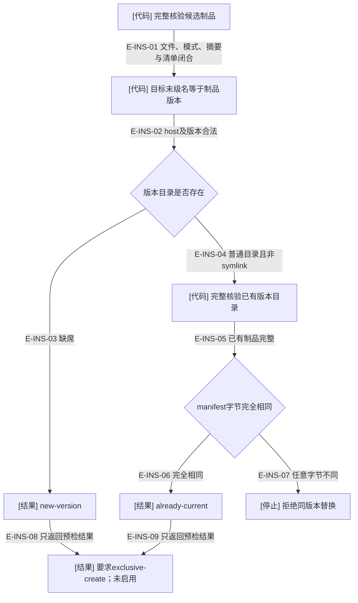
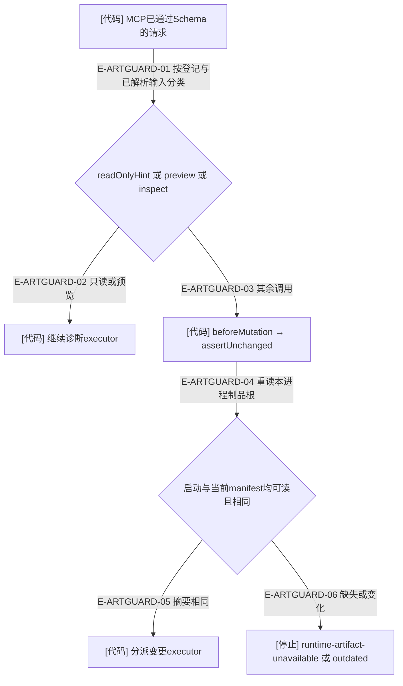
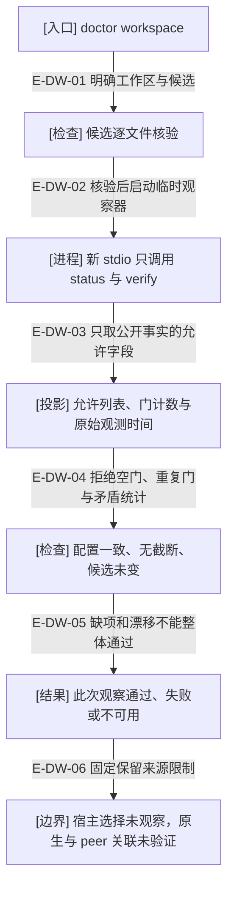

# 安装预检与运行进程：两处不同的身份边界

当前版本输入为 `1.1.0-rc.5` 源码候选，不证明安装目录或运行会话已采用它。插件版本、配置/锁/观察合同编号各有自己的用途；当前配置和锁编号2不构成旧目录迁移承诺。

## 安装目录的只读预检

### 本图术语说明

| 术语 | 含义 |
| --- | --- |
| 完整核验 | verifyArtifactAgainstManifest比对文件集合、大小、摘要与模式；不能只比较版本字符串。 |
| exclusive-create | 后续真正安装器需要独占发布到新目录；预检没有预留目录，不保证之后仍缺席。 |
| already-current | 两个完整制品清单字节相同；不证明宿主选择它，也不证明运行进程已加载它。 |

### 本图边级证据

| 编号 | 代码证据 | 测试证据 | 边界 |
| --- | --- | --- | --- |
| E-INS-01 | `tooling/artifacts/check-plugin-artifacts.ts#verifyArtifactAgainstManifest` | `tests/artifacts/plugin-artifact-check.test.ts#verifyArtifactAgainstManifest` | 候选先完整核验。 |
| E-INS-02 | `tooling/artifacts/inspect-local-installation.ts#inspectLocalInstallation` | `tests/artifacts/immutable-local-installation.test.ts#inspectLocalInstallation` | 目标版本名不符直接拒绝。 |
| E-INS-03 | `tooling/artifacts/inspect-local-installation.ts#inspectLocalInstallation` 中的lstatSync观察 | `tests/artifacts/immutable-local-installation.test.ts#inspectLocalInstallation`（断言new-version；不创建目标的性质来自源码，未单独断言零写） | 首次预检不创建目标。 |
| E-INS-04 | `tooling/artifacts/inspect-local-installation.ts#inspectLocalInstallation` | 未覆盖：该测试未独立构造目标symlink负例；代码明确拒绝非普通目录。 | 不跟随目标符号链接。 |
| E-INS-05 | `tooling/artifacts/check-plugin-artifacts.ts#verifyArtifactAgainstManifest` | `tests/artifacts/plugin-artifact-check.test.ts#verifyArtifactAgainstManifest` | 已有目录同样完整核验。 |
| E-INS-06 | `tooling/artifacts/inspect-local-installation.ts#inspectLocalInstallation` | `tests/artifacts/immutable-local-installation.test.ts#inspectLocalInstallation` | 相同字节返回already-current。 |
| E-INS-07 | `tooling/artifacts/inspect-local-installation.ts#inspectLocalInstallation` | `tests/artifacts/immutable-local-installation.test.ts#inspectLocalInstallation` | 拒绝后原目录清单字节保持。 |
| E-INS-08 | `tooling/artifacts/inspect-local-installation.ts#inspectLocalInstallation` | `tests/artifacts/immutable-local-installation.test.ts#inspectLocalInstallation` | activation为not-performed。 |
| E-INS-09 | `tooling/artifacts/inspect-local-installation.ts#inspectLocalInstallation` | `tests/artifacts/immutable-local-installation.test.ts#inspectLocalInstallation` | 不执行安装或宿主启用。 |

## 运行进程的变更分派门

### 本图术语说明

| 术语 | 含义 |
| --- | --- |
| 启动摘要 | 当前进程启动时固定的manifest字节摘要；不会随磁盘变更自动更新。 |
| 分派门 | 真实生成MCP组合根注入的beforeMutation；源测试根无清单时可用，不泛化为所有直接库调用受此门保护。 |
| 清单检查 | 观察同一位置的manifest；不能证明所有加载模块未被替换、宿主选中的兄弟版本或技能已重载。 |

### 本图边级证据

| 编号 | 代码证据 | 测试证据 | 关系与限制 |
| --- | --- | --- | --- |
| E-ARTGUARD-01 | `src/entrypoints/wakeflow-public-mcp-tool.ts#registerWakeflowPublicMcpCatalog` | 间接覆盖：`tests/entrypoints/wakeflow-artifact-mutation-guard.test.ts#createWakeflowPublicMcpServer`（真实SDK分派） | readOnlyHint、mode与operation共同判断。 |
| E-ARTGUARD-02 | `src/entrypoints/wakeflow-public-mcp-tool.ts#registerWakeflowPublicMcpCatalog` | 间接覆盖：`tests/entrypoints/wakeflow-artifact-mutation-guard.test.ts#createWakeflowPublicMcpServer`（preview绕过变更门） | 仍执行正常请求/结果检查。 |
| E-ARTGUARD-03 | `src/entrypoints/wakeflow-public-mcp-tool.ts#registerWakeflowPublicMcpCatalog` | 间接覆盖：`tests/entrypoints/wakeflow-artifact-mutation-guard.test.ts#createWakeflowPublicMcpServer`（apply前拒绝） | 门失败时executor未被调用。 |
| E-ARTGUARD-04 | `src/entrypoints/wakeflow-artifact-identity.ts#resolveWakeflowArtifactIdentity` | `tests/entrypoints/wakeflow-artifact-mutation-guard.test.ts#resolveWakeflowArtifactIdentity` | generated入口或启动摘要已知时严格比较。 |
| E-ARTGUARD-05 | `src/entrypoints/wakeflow-artifact-identity.ts#resolveWakeflowArtifactIdentity` 的assertUnchanged | `tests/entrypoints/wakeflow-artifact-mutation-guard.test.ts#resolveWakeflowArtifactIdentity` | 首次一致不抛错。 |
| E-ARTGUARD-06 | `src/entrypoints/wakeflow-artifact-identity.ts#resolveWakeflowArtifactIdentity` 的assertUnchanged | `tests/entrypoints/wakeflow-artifact-mutation-guard.test.ts#resolveWakeflowArtifactIdentity` | 修改和删除manifest分别得到outdated/unavailable。 |

[制品构建](./README.md) · [验证层次](./schema-and-validation.md) · [公共MCP与宿主](../09-public-mcp-host-seams/README.md)

## doctor 对不同观察来源的区分

`tooling/diagnostics/doctor.ts#inspectDevelopmentEnvironment` 只探测本次 CLI 的 Node/npm/Git；不是聊天内宿主运行环境。`tooling/diagnostics/doctor.ts#inspectArtifactInstallation` 复用逐文件制品核验，分开报告候选、指定安装目录和导入运行观察。

| 结果 | 已有事实 | 不可推出的结论 |
| --- | --- | --- |
| same-artifact | 候选与指定目录清单完整且摘要相同 | 宿主已经选用该目录或目标窗口进程已重载 |
| same-version-different-bytes | 版本相同但清单摘要不同 | 可以覆盖既有版本目录 |
| imported-report | 文件中的status字段可用于比较 | 文件自称verified、UI确认或相同摘要能证明实时激活 |
| 新stdio观察器匹配 | 刚启动的指定制品进程与磁盘身份相符 | 已有Codex/Claude角色窗口也在运行同一进程 |

导入报告被硬性标为 verified:false / activation:unverified，缺宿主选择、hook或可信窗口关联时不猜测原因；只读对照覆盖见 `tests/tooling/diagnostics/doctor.test.ts#inspectArtifactInstallation`。新[lab/live流程](./lab-and-live-tools.md)沿用相同来源限制。

本轮维护工具没有改动两个rc.5制品、安装缓存或运行时分派门；“目录完整”“刚启动的观察器正确”和“既有会话已加载”仍是三个独立结论。

## 工作区只读诊断：新观察进程与 peer 身份分开

### 本图术语说明

| 术语 | 含义 |
| --- | --- |
| 新 stdio | 为诊断单独启动并最终关闭的生成制品进程；不能拿它替代某个原生聊天的 MCP。 |
| 允许列表 | 只输出摘要、数量、门名、受限码与时间；身份、路径、原始证据和任意扩展字段不复制。 |
| 一致性 | status 与 verify 保留各自时间和配置摘要；不是跨两次调用的事务快照。 |
| 整体通过 | 仅指本次工作区探测，原生验收和窗口关联仍独立为 unverified。 |

### 本图边级证据

| 编号 | 代码证据 | 测试证据 |
| --- | --- | --- |
| E-DW-01 | `tooling/cli.ts#runDoctorCommand` 只接受 root 与 candidate。 | `tests/tooling/diagnostics/workspace.test.ts#runToolingCli` |
| E-DW-02 | `tooling/diagnostics/workspace.ts#inspectWorkspace`委托inspectWorkspaceWithObservations及diagnoseWorkspace，再复用核验和withLabMcp。 | `tests/tooling/diagnostics/workspace.test.ts#inspectWorkspace` |
| E-DW-03 | `tooling/diagnostics/workspace.ts#summarizeWorkspaceProbe` 不复制任意字段。 | `tests/tooling/diagnostics/workspace.test.ts#summarizeWorkspaceProbe`（隐私字段注入） |
| E-DW-04 | summarizeWorkspaceProbe 校验非空、唯一门、计数/ok，保留配置与截断。 | `tests/tooling/diagnostics/workspace.test.ts#summarizeWorkspaceProbe` |
| E-DW-05 | `tooling/diagnostics/workspace.ts#diagnoseWorkspace`比较候选、自身运行摘要、门、配置和截断，再决定状态。 | `tests/tooling/diagnostics/workspace.test.ts#inspectWorkspace`（真实零写与失败） |
| E-DW-06 | `tooling/diagnostics/workspace.ts#PROVENANCE` 独立固定来源和原生限制。 | `tests/tooling/diagnostics/workspace.test.ts#inspectWorkspace` |

此命令不读取宿主私有数据库，不自动修复、重启或信任 hook；原生工具或项目入口缺失仍需真实宿主事实。需要保留选定原始文件与部分观察时使用独立的doctor collect。[用法与退出约定](../../../docs/references/maintainer-tools.md)。

本轮接线复核：capture与receipt入口仅在维护CLI分发，不改变此页的安装预检、只读doctor和运行进程身份门。导入回执也不能作为激活证据。

诊断过程现在由 `tooling/diagnostics/workspace.ts#inspectWorkspaceWithObservations`向私有收集器提供同一次调用的SDK投影；原inspectWorkspace返回面保留。失败路径若已核验候选，则保留其artifact信息，但observer匹配和原生激活仍未确认。新分享面另按封闭字段和值类别重建，见[故障包](./diagnostic-bundles.md)。
