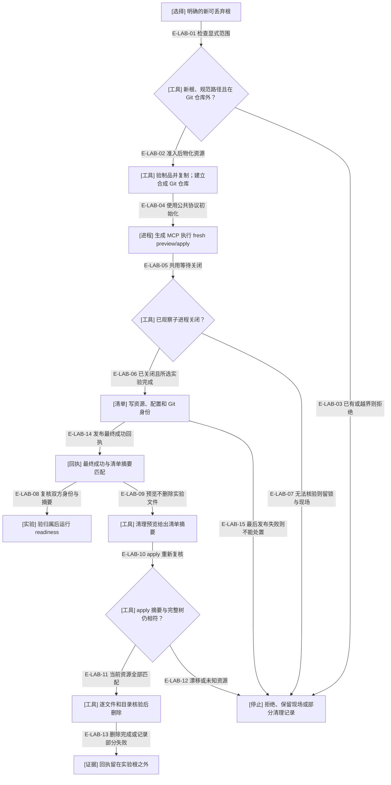
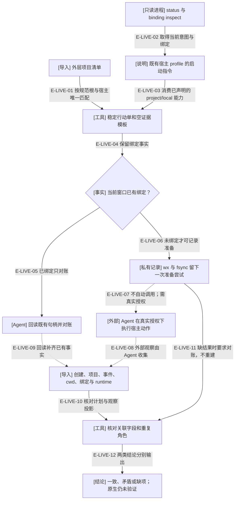

# 实验环境与原生行动单：先限定资源，再分别判断证据

lab 管理自己新建的合成资源；live 消费现有配置和宿主 profile，帮助 Agent 建立/对账项目聊天。二者的私有清单都不拥有 Demand 阶段、业务接受或宿主权限。

## 合成实验的资源生命周期

### 本图术语说明

| 术语 | 含义 |
| --- | --- |
| 资源容器 | lab 新根包含 `Workspace/`、Alpha/Beta、ledger 和 Artifact；只有 `Workspace/` 是此预设的 Wakeflow 程序根。 |
| 冻结清单 | 含 `.git`、制品、目录、dev/inode、模式与文件摘要；必须同时有匹配的最终成功回执，后续修改不会被自动收编。 |
| readiness | idle、新进程制品身份、verify、reconcile 零步/no-op、pod 创建预览及前后完整树一致；不是业务闭环。 |
| 关闭确认 | SDK 非等待 close 与 owner finally 共用 Promise，等待真实关闭事件；关闭不明时 lab 保留操作锁。 |
| 精确清理 | preview 摘要加 apply 前重验；逐项 unlink/rmdir，不用递归删除吞掉后来加入的内容。 |

### 本图边级证据

| 编号 | 代码证据 | 测试证据 |
| --- | --- | --- |
| E-LAB-01 | `tooling/lab/lab.ts#createLab` 检查新根、父目录、仓库与 home 边界。 | `tests/tooling/lab/lab.test.ts#createLab` |
| E-LAB-02 | createLab 核验副本摘要，创建 Workspace/Alpha/Beta 的合成初始提交。 | `tests/tooling/lab/lab.test.ts#createLab` |
| E-LAB-03 | 已存在、Git 祖先和非规范路径在创建前拒绝。 | `tests/tooling/lab/lab.test.ts#createLab` |
| E-LAB-04 | `tooling/lab/scenarios.ts#initializeLab` 使用实际 preview 摘要执行 apply。 | 间接覆盖：`tests/tooling/lab/lab.test.ts#createLab` 经两份真实生成制品初始化。 |
| E-LAB-05 | `tooling/lab/mcp-session.ts#AwaitedStdioTransport` 与 withLabMcp 的 finally。 | `tests/tooling/lab/lab.test.ts#withLabMcp` |
| E-LAB-06 | `tooling/lab/lab.ts#createLab` 在初始/业务实验完成且 withLabMcp 返回后才发布资源清单。 | `tests/tooling/lab/lab.test.ts#createLab`、`tests/tooling/lab/workflow.test.ts#createLab` |
| E-LAB-07 | `tooling/lab/lab.ts#exclusively` 对 shutdown-unverified 保留锁。 | `tests/tooling/lab/lab.test.ts#StdioClientTransport`（注入关闭不明） |
| E-LAB-08 | `tooling/lab/lab.ts#runLab` 和 `tooling/lab/scenarios.ts#runReadinessScenario`。 | `tests/tooling/lab/lab.test.ts#runLab` |
| E-LAB-09 | `tooling/lab/lab.ts#disposeLab` preview 返回资源文件摘要。 | `tests/tooling/lab/lab.test.ts#disposeLab` |
| E-LAB-10 | 同一 owner 调 assertOwned 并比较摘要。 | `tests/tooling/lab/lab.test.ts#disposeLab` |
| E-LAB-11 | `tooling/lab/inventory.ts#removeInventoriedTree` 检查祖先和节点后逐项删除。 | `tests/tooling/lab/inventory.test.ts#removeInventoriedTree` |
| E-LAB-12 | `tooling/lab/inventory.ts#snapshotLabTree` 拒绝链接、跨设备、同字节替换及清单漂移。 | `tests/tooling/lab/inventory.test.ts#snapshotLabTree` |
| E-LAB-13 | disposeLab 将完成/部分失败写在外部报告目录。 | `tests/tooling/lab/lab.test.ts#disposeLab` |
| E-LAB-14 | `tooling/lab/lab.ts#loadLab` 要求 creation passed、身份与 inventoryDigest 匹配。 | `tests/tooling/lab/sealing.test.ts#inspectLab` |
| E-LAB-15 | 中间 resources 存在但最终回执发布失败，不取得后续操作或删除权限。 | `tests/tooling/lab/sealing.test.ts#createLab`、`tests/tooling/lab/sealing.test.ts#disposeLab` |

创建未完成的中间清单不能用于自动清理；成功回执是另一项必要条件。新增固定业务实验见[业务场景与 worktree 保护](./lab-business-scenarios.md)。删除中途失败不回滚，进程不明不按 PID 或超时抢锁。该防护针对协作维护流程，不宣称可抵抗同用户恶意竞争、清单篡改或底层路径竞争；不能套到真实产品目录批量清理。

## 项目聊天行动单与证据核对

### 本图术语说明

| 术语 | 含义 |
| --- | --- |
| 外层项目 | 含 wakeflow.config.json 的实际工作区根对应项目；角色 cwd 与项目归属分别核对，不凭标题猜测。 |
| profile | 宿主源码拥有启动语义，live 只消费 inspection 返回的执行说明；当前场景仅支持 project/local 主工作区。 |
| 准备尝试 | 记录一次准备调用，不证明已调用或已落地；键跨重复规划、标题与候选变化保持稳定。 |
| 虚线 | 维护者/Agent 的外部动作与收集步骤，不是 CLI 的运行时调用或授权。 |
| 一致性与真实性 | 字段全匹配可得到 consistency:passed，但整体仍 unavailable；用户 UI 确认与自称 verified 均不改变导入来源。 |

### 本图边级证据

| 编号 | 代码或过程证据 | 测试证据 |
| --- | --- | --- |
| E-LIVE-01 | `tooling/live/plan.ts#projectFor` 要求 path/hostId/local 类型唯一匹配。 | `tests/tooling/live/live.test.ts#planLiveProject` |
| E-LIVE-02 | `tooling/live/plan.ts#observeLiveWorkspace` 通过生成 MCP 只读获取当前事实。 | `tests/tooling/live/live.test.ts#planLiveProject` |
| E-LIVE-03 | `tooling/live/plan.ts#windowFromInspection` 检查 profile 声明，不在 CLI 另造宿主启动器。 | `tests/tooling/live/live.test.ts#planLiveProject`（不支持能力拒绝） |
| E-LIVE-04 | `tooling/live/plan.ts#planLiveProject` 保留 bindingStatus/bindingId。 | `tests/tooling/live/live.test.ts#loadLivePlan` |
| E-LIVE-05 | `tooling/live/attempts.ts#recordLiveAttempt` 对已绑定拒绝新建。 | 间接覆盖：`tests/tooling/live/live.test.ts#recordLiveAttempt`；既有5绑定的拒绝另有先前实际CLI观察。 |
| E-LIVE-06 | recordLiveAttempt 重读当前输入，再用稳定键 wx/fsync 写记录。 | `tests/tooling/live/live.test.ts#execFile`（两独立CLI进程） |
| E-LIVE-07 | `tooling/live/attempts.ts#recordLiveAttempt` 返回 hostEffectsPerformed:false 与外部授权要求；外部步骤见维护工具说明。 | 未覆盖：本工具没有原生创建调用；不把合成测试画成宿主动作通过。 |
| E-LIVE-08 | `tooling/live/contracts.ts#readDocument` / unwrapResult 仅解析导入材料。 | 间接覆盖：`tests/tooling/live/live.test.ts#inspectLiveEvidence`，原生创建/采集未执行。 |
| E-LIVE-09 | `tooling/live/evidence.ts#checkWindow` 接受已有绑定的观察投影。 | `tests/tooling/live/live.test.ts#inspectLiveEvidence`（身份与目录反例；未替代真实回读） |
| E-LIVE-10 | `tooling/live/evidence.ts#inspectLiveEvidence` 拒绝重复窗口、复用线程及不匹配字段。 | `tests/tooling/live/live.test.ts#inspectLiveEvidence` |
| E-LIVE-11 | `tooling/live/evidence.ts#verifyLiveEvidence` 验配置及记录，缺观察要求 reconciliation。 | `tests/tooling/live/live.test.ts#verifyLiveEvidence` |
| E-LIVE-12 | inspectLiveEvidence 固定 imported-unverified、nativeHostAcceptance/windowToMcpAssociation unverified。 | `tests/tooling/live/live.test.ts#inspectLiveEvidence`（完整合成观察与伪造verified仍不可升格） |

live 不重新准入全部公共 Schema，也不为导入观察提供签名或时效认证。Claude、原生投递/回传、worktree 业务验收未被这个场景覆盖；后续修复仍应由实际 owner 的协议与宿主事实推进。

[运行证据主体](../16-observation/runtime-evidence.md) · [项目与执行根](../09-public-mcp-host-seams/project-chats-and-execution-roots.md) · [维护工具说明](../../../docs/references/maintainer-tools.md)

新增 `tooling/live/receipt.ts#captureHostReceipt` 仅保存导入请求/返回并区分字节摘要与JSON摘要；不改变上述live plan/attempt/verify关系。实际边界和原字节回归见[回执保存](./test-capture-and-receipts.md)与 `tests/tooling/live/receipt.test.ts#captureHostReceipt`。

新增doctor收集/导出分支不改变本页原有操作或权限；其源文件、SDK投影和分享规则由[诊断包](./diagnostic-bundles.md)说明。已有capture、live及lab的职责边界继续保留。
