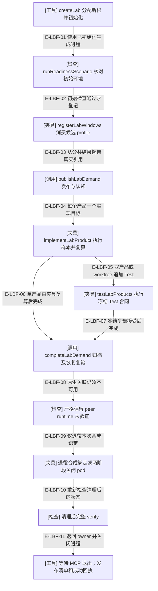
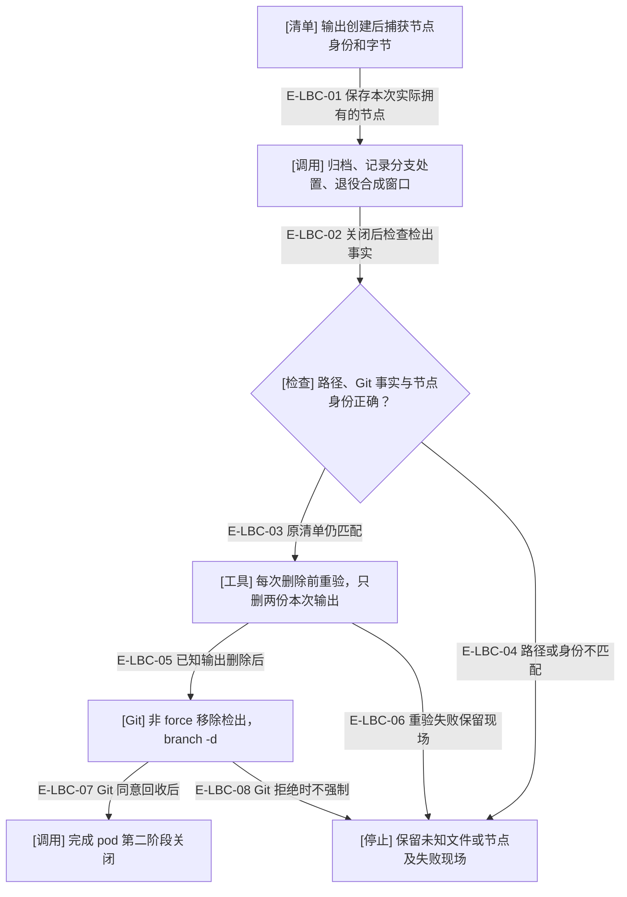

# 固定业务实验与清理

`lab run --scenario` 只接受 single-product、dual-product、worktree，以及一个新可丢弃目录。它在生成制品上实际调用公共 MCP、运行算术模块、登记证据、复算、完成归档；宿主身份与 hook 由测试驱动合成，原生验收始终未验证。它不接受用户产品任务，也不拥有新的 Demand 状态机。

## 新目录中的顺序调用

### 本图术语说明

| 术语 | 含义 |
| --- | --- |
| 夹具 | 固定算术输入、实现和预期；真实 Node 子进程执行，不能扩展成用户任务的自动验收。 |
| 合成宿主 | 候选自带 profile 和生成 hook 入口产生本实验的观察；没有实际聊天、tmux pane 或发送。 |
| Test | 独立逻辑测试目标及逐步证据；本图没有真实 Test Agent。 |
| peer runtime | 已绑定窗口到 MCP 的运行关联；当前合成记录不能建立它，verify 必须保持 unavailable。 |
| 封存 | 新创建阶段成功后，资源清单还须配有摘要匹配的最终成功回执，才能供后续操作使用。 |

### 本图边级证据

| 编号 | 代码证据 | 测试证据 |
| --- | --- | --- |
| E-LBF-01 | `tooling/lab/lab.ts#createLab` 委托 `tooling/lab/workflow.ts#runWorkflowScenario`。 | `tests/tooling/lab/workflow.test.ts#runToolingCli` |
| E-LBF-02 | `tooling/lab/workflow.ts#runWorkflowScenario` 先 readiness，再 registerLabWindows。 | 间接覆盖：`tests/tooling/lab/workflow.test.ts#runToolingCli` 经真实双制品执行。 |
| E-LBF-03 | `tooling/lab/synthetic-host.ts#registerSyntheticWindow` 与 `tooling/lab/workflow-demand.ts#publishLabDemand`；worktree 中产品先于 Test。 | 间接覆盖：`tests/tooling/lab/workflow.test.ts#runToolingCli` 核对 Test 附加检出。 |
| E-LBF-04 | `tooling/lab/workflow-target.ts#implementLabProduct` 按当前 revision 规划、实际运行并记录结果。 | 间接覆盖：`tests/tooling/lab/workflow.test.ts#createLab` 在结果导入后修改产品，要求接受前失败。 |
| E-LBF-05 | `tooling/lab/workflow-test.ts#testLabProducts` 在支持面产生不同的 Test 证据。 | 间接覆盖：`tests/tooling/lab/workflow.test.ts#runToolingCli` 核对双产品及 worktree 场景。 |
| E-LBF-06 | runWorkflowScenario 的 single-product 分支不创建 Test 目标；实现复算由 `tooling/lab/workflow-target.ts#recheckProduct` 执行。 | 间接覆盖：`tests/tooling/lab/workflow.test.ts#runToolingCli` 核对一个实现及 independentTest:false。 |
| E-LBF-07 | `tooling/lab/workflow-test.ts#testLabProducts` 要求 test-accepted，随后完成。 | 间接覆盖：`tests/tooling/lab/workflow.test.ts#runToolingCli` 的实际协议链。 |
| E-LBF-08 | `tooling/lab/workflow.ts#runWorkflowScenario` 要求唯一未通过门为计数相符的 runtime-artifact unavailable。 | 间接覆盖：`tests/tooling/lab/workflow.test.ts#runToolingCli`；最终回执保留退役前结果。 |
| E-LBF-09 | `tooling/lab/synthetic-host.ts#decommissionSyntheticWindow` 或 `tooling/lab/workflow-pod.ts#closeLabPod`。 | 间接覆盖：`tests/tooling/lab/workflow.test.ts#runToolingCli` 核对清理结果。 |
| E-LBF-10 | runWorkflowScenario 再次要求全部 verify 通过；不能用它替换退役前 unavailable。 | 间接覆盖：`tests/tooling/lab/workflow.test.ts#runToolingCli`；nativeHostAcceptance 仍 unverified。 |
| E-LBF-11 | `tooling/lab/mcp-session.ts#withLabMcp` 结算后，createLab 写 resources 与 creation；`tooling/lab/lab.ts#loadLab` 交叉检查。 | `tests/tooling/lab/sealing.test.ts#createLab`、`tests/tooling/lab/sealing.test.ts#inspectLab` |

失败或取消保留现场，不支持旧目录续跑；需要检查后用另一个新目录重做。这里的持久化档位指生成 MCP 的生产默认写入；工具回执使用既有临时文件替换，不是断电持久性认证。

## worktree 输出的精确清理

### 本图术语说明

| 术语 | 含义 |
| --- | --- |
| 节点身份 | dev/inode、模式与摘要；另一个相同内容的文件也不自动归属本次实验。 |
| 两份输出 | 固定 summarize.mjs 和 verification.json；不递归抹除产品工作区。 |
| 非 force | Git 自己拒绝剩余脏文件、未知文件或无法安全处置的分支；工具不改为强制删除。 |
| 失败现场 | 可能已有部分已知输出删除或 pod 处于 closing；不自动回滚、收编或续跑。 |

### 本图边级证据

| 编号 | 代码证据 | 测试证据 |
| --- | --- | --- |
| E-LBC-01 | `tooling/lab/workflow-target.ts#recordProductEvidence` 保存 checkoutInventory。 | 间接覆盖：`tests/tooling/lab/sealing.test.ts#createLab` 的同字节替换场景。 |
| E-LBC-02 | `tooling/lab/workflow-pod.ts#closeLabPod` 在退役后核对精确五项路径、README 与 Git HEAD。 | 间接覆盖：`tests/tooling/lab/workflow.test.ts#createLab` 注入未知文件。 |
| E-LBC-03 | closeLabPod 调 `tooling/lab/inventory.ts#assertSameInventory` 后删除已知输出。 | 间接覆盖：`tests/tooling/lab/sealing.test.ts#createLab` 要求新节点保留。 |
| E-LBC-04 | 路径集合或原清单失配使整个实验失败，资源不自动封存。 | `tests/tooling/lab/workflow.test.ts#createLab`、`tests/tooling/lab/sealing.test.ts#createLab` |
| E-LBC-05 | closeLabPod 两次精确 unlink 后调用 `tooling/lab/inventory.ts#labGit`。 | 间接覆盖：`tests/tooling/lab/workflow.test.ts#runToolingCli` 核对两份检出消失。 |
| E-LBC-06 | 每次 unlink 前重新快照并比较剩余原清单。 | 间接覆盖：`tests/tooling/lab/sealing.test.ts#createLab`；删除间隙的所有 OS 调度组合未穷尽。 |
| E-LBC-07 | worktree remove 与 branch -d 成功后再调用公共 pod close。 | 间接覆盖：`tests/tooling/lab/workflow.test.ts#runToolingCli` 的真实 Git 场景。 |
| E-LBC-08 | labGit 的错误返回不包含任意 stderr；调用失败直接保留场景。 | 未覆盖：本轮没有穷尽 Git 命令的所有系统级失败；不把资源替换回归计为完整 Git 故障矩阵。 |

[实验与 live 边界](./lab-and-live-tools.md) · [维护命令与退出约定](../../../docs/references/maintainer-tools.md) · [本轮逐文件审阅](../../plans/review-2026-10-04-lab-workflows/tooling-files.json)

本轮接线复核：新增capture是独立维护入口，不接入lab固定场景或其清理；本页lab调用、合成来源与资源保护分支未改。历史材料重放另见测试捕获页，不记为新的native业务。

新增doctor收集/导出分支不改变本页原有操作或权限；其源文件、SDK投影和分享规则由[诊断包](./diagnostic-bundles.md)说明。已有capture、live及lab的职责边界继续保留。
