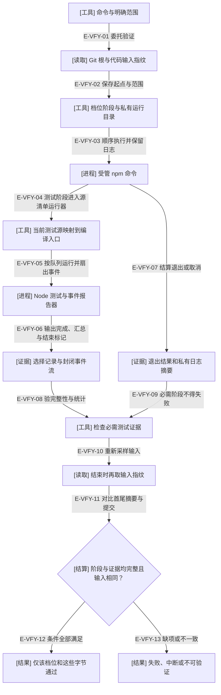

# 维护验证：输入、执行和结算分别留证

`wf verify` 委托原有 npm 门，不是新的业务 Controller。quick 包含全仓静态检查和明确选择的测试；gate 执行现有 `npm test`；artifact 执行 build:check 和独立 smoke。失败不自动重试，制品漂移也不由该入口悄悄重建。

### 本图术语说明

| 术语 | 含义 |
| --- | --- |
| 输入指纹 | tracked 与非忽略 untracked 的代码、测试、tooling、制品、CI 和根配置；同时保留 commit、dirty 与内容摘要。docs、图谱、构建输出不纳入。 |
| 受管命令 | 参数数组、shell:false、私有日志；POSIX 单独进程组，取消/超时先终止再收尾后代。Windows 分支未实机验证。 |
| 封闭事件流 | header、测试/汇总事件和 end；须有唯一总汇总及每个选中文件的汇总，非终端 spec 文本解析。 |
| 结算 | passed 需要必需阶段通过、零失败/取消/skip/todo、完整证据与相同输入；无法结算不补造成功。 |
| 测试阶段 | artifact 档位没有此分支；quick 与 gate 按自己的范围运行，不能把 quick 扩大为整门。 |

### 本图边级证据

| 编号 | 代码证据 | 测试证据 |
| --- | --- | --- |
| E-VFY-01 | `tooling/cli.ts#runToolingCli` 校验范围后调用 verifyRepository。 | 间接覆盖：`tests/tooling/verification/verify.test.ts#runToolingCli` 检查非法组合；执行体由 verifyRepository 用例覆盖。 |
| E-VFY-02 | `tooling/verification/verify.ts#verifyRepository` 调用 `tooling/verification/input-identity.ts#captureVerificationInput` 并写 running 回执。 | `tests/tooling/verification/verify.test.ts#captureVerificationInput` |
| E-VFY-03 | `tooling/verification/verify.ts#stagesFor` 与 `tooling/verification/process.ts#runLoggedCommand`。 | `tests/tooling/verification/verify.test.ts#verifyRepository` |
| E-VFY-04 | `tooling/testing/run-typescript-tests.ts#compiledTypeScriptTests` 从当前源清单取文件；外部 npm 阶段是进程调用。 | `tests/tooling/testing/run-typescript-tests.test.ts#compiledTypeScriptTests` |
| E-VFY-05 | `tooling/testing/run-typescript-tests.ts#run` 调 prepareTestRecording，以 node:test.run 保留文件顺序，将同一TestsStream分别送入spec与原事件reporter。 | 间接覆盖：`tests/tooling/testing/test-recording.test.ts#inspectTestRecording` 启动真实 Node 并检查事件。 |
| E-VFY-06 | `tooling/testing/test-event-reporter.ts#testEventReporter` 只投影完成/汇总事件并结束。 | 间接覆盖：`tests/tooling/testing/test-recording.test.ts#inspectTestRecording` 验证通过、失败、跳过与取消。 |
| E-VFY-07 | `tooling/verification/process.ts#runLoggedCommand` 记录 code/signal/reason；取消在 close 时收尾进程组。 | `tests/tooling/verification/verify.test.ts#runLoggedCommand` |
| E-VFY-08 | `tooling/testing/test-recording.ts#inspectTestRecording` 拒绝截断、拼接及不完整/不一致统计。 | `tests/tooling/testing/test-recording.test.ts#inspectTestRecording` |
| E-VFY-09 | `tooling/verification/verify.ts#verifyRepository` 失败阶段停止后续；缺事件不可为绿。 | `tests/tooling/verification/verify.test.ts#verifyRepository` |
| E-VFY-10 | `tooling/verification/verify.ts#verifyRepository` 再调用 captureVerificationInput。 | `tests/tooling/verification/verify.test.ts#verifyRepository`（执行中修改源码） |
| E-VFY-11 | `tooling/verification/verify.ts#verifyRepository` 比较 commit 和 digest。 | `tests/tooling/verification/verify.test.ts#captureVerificationInput` |
| E-VFY-12 | `tooling/verification/verify.ts#testOutcome` 和最终 status/exitCode 投影。 | `tests/tooling/verification/verify.test.ts#verifyRepository` |
| E-VFY-13 | 同一 owner 保留 failed/interrupted/unavailable，不改写为通过。 | `tests/tooling/verification/verify.test.ts#verifyRepository` |

## 文件、来源与耐久性的边界

私有记录位于 `.build/verification/`，保留选中的编译入口、运行器、模型参数、原始日志和摘要。reporter 不序列化 Error 对象或任意 stdout，但 case 名仍可能含路径，不能直接当作分享包。

`tooling/verification/files.ts#writeReport` 是维护报告的 `.next` 写入与 rename，不是业务 journal 或断电事务。输入只比较起点与终点，不排除期间修改后恢复；锁文件与版本号也不证明所有已安装依赖字节。当前回执是可追溯的本地观察，不是签名来源证明。

`tooling/testing/test-duration-report.ts#proposeTestDurations` 要求同输入的完整 gate、重验事件摘要及当前测试库存，才输出建议表；不覆盖已跟踪耗时表。取消分类在文件和汇总层可能不同，两层都保留。

[验证层次](./schema-and-validation.md) · [CI 与模型证据](./ci-and-model-evidence.md) · [维护命令使用说明](../../../docs/references/maintainer-tools.md)

本轮修复真实派发接线：Node 24 CLI会重排显式文件参数，旧的纯排序测试未覆盖这一边界；改用官方run API，保留同一源清单、进程隔离、并发预算和事件格式。真实双文件执行与取消回归见 `tests/tooling/testing/test-schedule-order.test.ts#spawnSync`、`tests/tooling/testing/test-recording.test.ts#runLoggedCommand`。执行结果见[本轮来源](../../plans/review-2026-10-04-lab-workflows/validation-provenance.md)。

本轮CLI新增capture与receipt分支，verify档位和原执行链未改。两者的完整性结果不能替代此处源码门，也不能从本地日志推出业务接受，见[测试记录边界](./test-capture-and-receipts.md)。

本批显式采用上一批完整门导出的279文件耗时建议，数据版本与测量来源写在test-durations.json；未知诊断测试仍先运行，原用例/断言/超时不变。这是新的输入，需要新的完整门，不能重用1313项旧通过。没有更改proposeTestDurations的只读行为。
