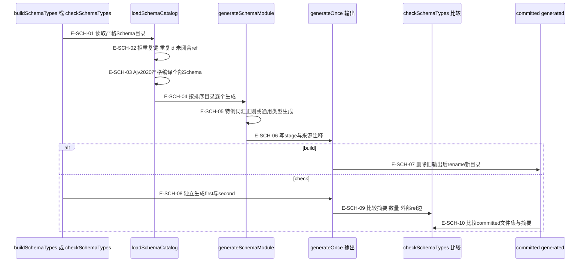

# Schema 生成与验证层次

JSON Schema 拥有可移植字段形状；生成 TypeScript 提供类型、运行时 Schema、词汇与基础正则。手写 parser 再补跨字段、来源一致性、权限和效果守卫。`schema:check` 证明生成物未漂移，不替代这些领域判断。

### 本图术语说明

| 术语 | 含义 |
| --- | --- |
| 严格目录 | 只允许真实目录与 `.schema.json` 普通单链接文件；文件/数量有预算，禁止符号链接、重复JSON键与重复$id。 |
| 闭合ref | 每个外部 `$ref` 的文档$id必须存在于同一目录；通用生成器禁用HTTP解析，按本地catalog解引用。 |
| 特例合同 | durable-id-kind生成冻结枚举；UTC instant、portable path、SHA-256生成同Schema正则源；其余交json-schema-to-typescript。 |
| runtime Schema | x-wakeflow-runtime-export 选择导出名；从JSON文本恢复自有键并递归冻结，供手写parser的Ajv使用。 |
| 独立两遍 | check 在 `.build` scratch下生成first、second，先证明确定性，再比src/contracts/generated；不能把generated作为scratch。 |

### 本图边级证据

| 编号 | 代码证据 | 测试证据 |
| --- | --- | --- |
| E-SCH-01 | `tooling/codegen/schema-types.ts#generateOnce` 每次调用 loadSchemaCatalog；`collectSchemaFiles` 检查目录与预算。 | `tests/codegen/schema-types.test.ts#loadSchemaCatalog` |
| E-SCH-02 | `tooling/codegen/schema-types.ts#loadSchemaCatalog` 检查 duplicateObjectKeyExists、唯一id及 externalRefs。 | `tests/codegen/schema-types.test.ts#SchemaCodegenError` |
| E-SCH-03 | `tooling/codegen/schema-types.ts#validateSchemaCatalog` 注册全部Schema，再以严格Ajv2020逐个getSchema。 | `tests/codegen/schema-types.test.ts#loadSchemaCatalog` |
| E-SCH-04 | generateOnce 按排序catalog调用 `tooling/codegen/schema-types.ts#generateSchemaModule`。 | `tests/codegen/schema-types.test.ts#buildSchemaTypes` |
| E-SCH-05 | generateSchemaModule 的四个$id特例与compile；`tooling/codegen/schema-types.ts#runtimeSchemaModuleLines` 注入冻结运行时Schema。 | `tests/codegen/schema-types.test.ts#buildSchemaTypes` |
| E-SCH-06 | generateOnce 用 wx 写每个generated文件，包含源码Schema相对路径，不包含机器路径。 | `tests/codegen/schema-types.test.ts#buildSchemaTypes` |
| E-SCH-07 | generateOnce 顺序调用 removeOutput(prepared.resolved)、renameSync(stage, prepared.resolved)。 | 间接覆盖：`tests/codegen/schema-types.test.ts#buildSchemaTypes` 检查生成结果；未注入两步之间的进程崩溃。 |
| E-SCH-08 | `tooling/codegen/schema-types.ts#checkSchemaTypes` 调generateOnce到first/second两个子目录。 | `tests/codegen/schema-types.test.ts#checkSchemaTypes` |
| E-SCH-09 | checkSchemaTypes 比较digest、schemaCount、externalRefEdges；不同为schema-determinism。 | `tests/codegen/schema-types.test.ts#checkSchemaTypes` |
| E-SCH-10 | `tooling/codegen/schema-types.ts#inspectGeneratedOutput` 枚举committed仅允许.generated.ts，再比较digest和数量。 | `tests/codegen/schema-types.test.ts#checkSchemaTypes` |

Schema build 先删除旧输出再 rename stage。它没有业务journal，也没有制品构建器的backup恢复，因此不是跨崩溃的事务原子替换。check只把候选写到`.build`，对committed generated只读。

### 每层验证究竟证明什么

| 门 / 执行者 | 已核实的机制 | 证明与限制 | 测试证据 |
| --- | --- | --- | --- |
| typecheck | root package.json 调 tsc -b | 类型与项目引用；不证明业务状态转换正确。 | 未覆盖：编译器运行结果由实际门执行记录，不拿源码中存在脚本当通过。 |
| check:architecture | `tooling/architecture/check-dependencies.ts#run` 调 dependency-cruiser | 必须SWC、非零模块/依赖、零warning/error；无生产消费者的根必须在精确allowlist，陈旧allowlist也失败。 | 未覆盖：本文件是独立命令入口，其结果由主协调者运行确认。 |
| lint / format / unused | root脚本中的Biome与knip | 工程规则与可达性诊断；不代替手写语义审阅。 | 未覆盖：外部工具的实际退出码由统一验证记录。 |
| test:typescript | `tooling/testing/run-typescript-tests.ts#compiledTypeScriptTests` | 从当前.test.ts源清单映射编译输出；不运行被删源遗留的旧JS。focused拒重复/越界/缺输出/symlink。 | `tests/tooling/testing/run-typescript-tests.test.ts#compiledTypeScriptTests` |
| 测试排程 | `tooling/testing/run-typescript-tests.ts#orderTestSourcesByCost` | 未知耗时优先，其余长用例优先；表非法失败；仅影响排程，不增删选中测试。 | `tests/tooling/testing/test-schedule-order.test.ts#orderTestSourcesByCost` |
| 文件并发预算 | `tooling/testing/run-typescript-tests.ts#resolveTestConcurrency` | 默认取availableParallelism；WAKEFLOW_TEST_CONCURRENCY未设置或为空仍用默认，显式值只能为1到可用并行度的规范十进制安全整数。只改文件worker预算，不改选中测试、内部并发或超时。 | `tests/tooling/testing/run-typescript-tests.test.ts#resolveTestConcurrency` |
| schema:check | `tooling/codegen/schema-types.ts#checkSchemaTypes` | 双次生成确定性及committed字节一致；不证明Schema表达了全部业务关系。 | `tests/codegen/schema-types.test.ts#checkSchemaTypes` |
| build:check | `tooling/artifacts/check-plugin-artifacts.ts#checkWakeflowPluginArtifacts` | committed先自验文件集合/模式/摘要，再比全新候选manifest；同时核对两个marketplace。 | `tests/artifacts/plugin-artifact-check.test.ts#verifyArtifactAgainstManifest` |
| smoke:artifacts | `tooling/artifacts/smoke-plugin-artifacts.ts#smokeWakeflowPluginArtifacts` | 完整制品搬到仓库外；真实stdio、fresh、reconcile、status/verify、pod预览和hook Node进程；无需登录账户。 | `tests/artifacts/plugin-artifact-smoke.manual.ts#smokeWakeflowPluginArtifacts` |
| release:check | `tooling/release/check-release-consistency.ts#checkWakeflowReleaseConsistency` | 唯一版本与五源一致、Node范围、manifest、Git跟踪，加root脚本强制main/clean/tag/local-origin门。 | `tests/release/check-release-consistency.test.ts#checkWakeflowReleaseConsistency` |

root `npm test` 顺序是 typecheck → architecture → lint → format → unused → TypeScript tests → schema:check → build:check。**smoke独立于npm test**；candidate smoke的`.manual.ts`不会被普通测试清单自动收集。表内“测试证据”是已阅读的断言入口，不表示本页作者执行过全部门，实际执行结果以本轮统一验证记录为准。

### 当前协议与安装预检

当前95份Schema保持严格单基线：Config与status/verify的协议编号为2；当前锁也严格为2。ADR-0018已经撤掉新加的旧格式读取/迁移路径；不能将同格式reconfigure/recover画成旧格式升级。源码候选1.1.0-rc.5与内部协议编号分别管理；版本输入改变不代表安装已生效。

新增 `install:check` 只读核验版本目录并拒绝同版本不同字节，不保留目标也不激活宿主；详见[安装与分派门](./installation-and-runtime-identity.md)。

### smoke 与 release 的证据边界

smoke通过SDK调用制品中的MCP服务，hook则调用制品的observe launcher；它不创建真实Codex线程或已登录Claude会话。其零写检查是文件字节快照对比，排除`.git`和维护事务目录，不覆盖目录/模式/时间戳的全部变化；不能把smoke成功扩大成任何宿主、任何环境的验收。

release:check检查**本地**origin/main引用，没有fetch，也不会push/tag/publish。根脚本传入四个require选项；库函数默认选项没有强制这些Git门，缺省库调用不能冒充完整发布门。`releaseEligible:true`仍只来自版本主号>=1，不能反推已经发布。

[返回制品总览](./README.md) · [直接导入与动态装载](./file-dependencies.md) · [Foundation持久效果](../02-foundation/README.md)
