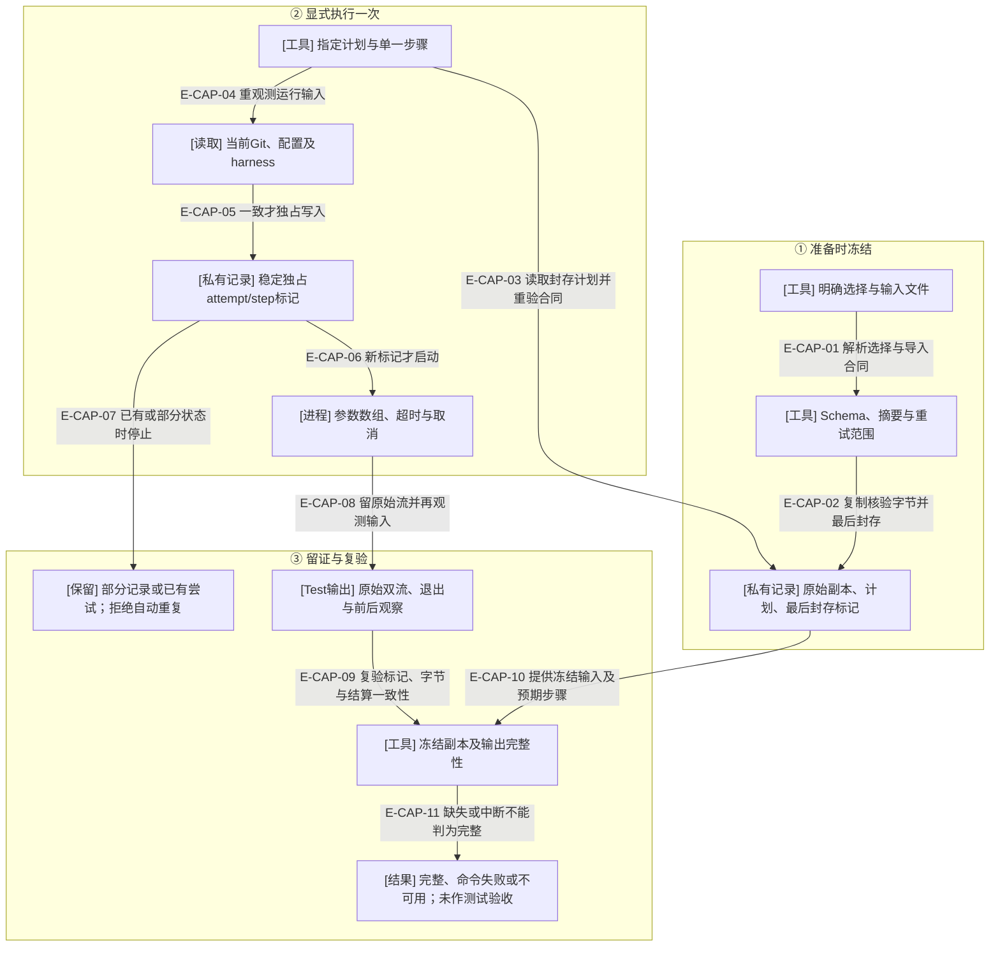
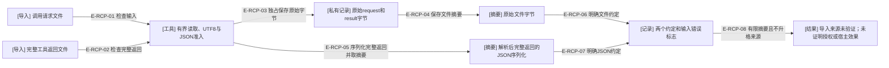

# 测试记录与导入回执：冻结输入，保留不确定结果

原生场景曾因脚本固定读取已轮换的snapshot而失败。新增维护入口只保存既有合同和显式命令，使输入存活期、一次执行和原始记录各有明确边界。没有增加运行时状态、延长快照保留或授予新的重试权限；也不进入生成插件。

## 单步骤捕获的实际调用

### 本图术语说明

| 术语 | 含义 |
| --- | --- |
| 封存 | 计划目录中的inputs、plan与最后写入的ready必须完整匹配；不是业务事件提交。 |
| harness | Test自行编写并明确列出的断言脚本/输入文件；工具不生成测试期望。 |
| 稳定标记 | 当前维护仓库内，按工作区、program、demand、target、attempt和step取键；重新prepare或换输出目录仍拒绝重复。标记不证明命令已经执行。 |
| 原始双流 | stdout与stderr分别逐字节留存；不合流、不截断后声称完整。 |
| 不可用 | 输入变化、日志超预算、取消、超时、缺记录或完整性矛盾。没有自动清除标记或补写成功的分支。 |

### 本图边级证据

| 编号 | 代码证据 | 测试证据 |
| --- | --- | --- |
| E-CAP-01 | `tooling/capture/model.ts#parseCaptureSelection` 与 `tooling/capture/contracts.ts#frozenTestContext`。 | 间接覆盖：`tests/tooling/capture/capture.test.ts#prepareCapture` 拒绝越过原通过步骤；`tests/tooling/capture/contracts.test.ts#frozenTestContext` 核对关系。 |
| E-CAP-02 | `tooling/capture/plan.ts#prepareCapture` 收集有限副本，wx写出并最后封存。 | `tests/tooling/capture/capture.test.ts#prepareCapture` 检查源删除、未知成员及部分封存。 |
| E-CAP-03 | `tooling/capture/run.ts#runCapture` 调 readCapturePlan 与 validateExecutablePlan。 | `tests/tooling/capture/capture.test.ts#runCapture`、`tests/tooling/capture/capture.test.ts#readCapturePlan`。 |
| E-CAP-04 | `tooling/capture/run.ts#currentInputs` 比较配置及harness，再调用 `tooling/capture/observations.ts#observeProduct`。 | 间接覆盖：`tests/tooling/capture/capture.test.ts#runCapture` 检查脏树、同字节替换及运行中变更。 |
| E-CAP-05 | `tooling/capture/run.ts#captureAttemptFile` 与 `tooling/capture/io.ts#writeExclusiveJson`。 | `tests/tooling/capture/capture.test.ts#captureAttemptFile` 及真实两CLI进程竞争。 |
| E-CAP-06 | `tooling/capture/run.ts#runCapture` 在独占记录之后调用 `tooling/verification/process.ts#runLoggedCommand`。 | `tests/tooling/capture/capture.test.ts#runCapture` 检查字面argv与原始流。 |
| E-CAP-07 | 同一owner在已有标记或已有输出时拒绝，不覆盖记录。 | `tests/tooling/capture/capture.test.ts#runCapture` 检查部分标记及跨计划重复。 |
| E-CAP-08 | `tooling/capture/run.ts#runCapture` 结算后再查预算/输入，独占写record。 | `tests/tooling/capture/capture.test.ts#runCapture` 检查失败、取消、超时与预算。 |
| E-CAP-09 | `tooling/capture/run.ts#inspectCapture` 比较主体、命令、marker、两个流和精确四文件集合。 | `tests/tooling/capture/capture.test.ts#inspectCapture` 检查改日志、退出声明及未知文件。 |
| E-CAP-10 | `tooling/capture/plan.ts#readCapturePlan` 检查非空步骤、规范selection、ready及副本摘要。 | `tests/tooling/capture/capture.test.ts#inspectCapture` 拒绝自摘要正确但空步骤的计划。 |
| E-CAP-11 | `tooling/capture/run.ts#inspectCapture` 将缺项/矛盾映射为unavailable，结算失败单列。 | `tests/tooling/capture/capture.test.ts#inspectCapture` 检查缺记录与非绿色结果。 |

## 执行边界

`tooling/capture/contracts.ts#selectEnvelope` 从直接信封或Schema准入的不可变event commit按预期摘要唯一选择；不读snapshot，也不验证完整事件链。任务包和信封的program/config/demand、目标、包摘要、窗口、attempt引用交叉一致；rerun另核对前次结果摘要、连续序号及未通过步骤。来源始终是导入合同，当前claim、授权和实时角色身份需调用方另外核验。

`tooling/capture/observations.ts#executionContext` 从配置的指定Test窗口定位support-surface；`productLocation`要求同pod产品窗口并拒绝与Test根重叠。Git要求报告中的committed基线、相同commonDir、明确HEAD和branch、干净状态及选定tracked文件的实际commit blob；工作树不能回退主检出或用复制仓库替代。未提交实现当前不适用。

观察范围是选定文件及Git状态，不涵盖忽略文件、所有传递依赖或执行器自身全部字节。外部命令不是沙箱，仍可产生任意自身效果；工具不能解释自然语言停止条件或替Agent决定下一步。50毫秒预算观察可能短时超量，超量保留并标为不可用。文件观察与摘要用于协作维护一致性，不是防恶意篡改的签名证明。

## 导入回执的两个摘要

### 本图术语说明

| 术语 | 含义 |
| --- | --- |
| 完整工具返回 | 调用工具返回的整个JSON对象，不仅是structuredContent，也不是工作区结果的任意外包装。 |
| 文件摘要 | 对UTF8文件的原始字节计算SHA-256，包含空白和末尾换行。 |
| JSON摘要 | 对解析后完整返回执行JSON.stringify，再对其UTF8取SHA-256；保持解析后的属性顺序，不是规范化JSON摘要。 |
| 导入来源 | 文件由调用方提供；isError:false、自述verified、人工确认等均不能单独使工具验证宿主效果。 |

### 本图边级证据

| 编号 | 代码证据 | 测试证据 |
| --- | --- | --- |
| E-RCP-01 | `tooling/live/receipt.ts#captureHostReceipt` 读取request并调用严格JSON准入。 | `tests/tooling/live/receipt.test.ts#captureHostReceipt`。 |
| E-RCP-02 | 同一owner限定返回4MiB，保留原始字节与解析对象。 | `tests/tooling/live/receipt.test.ts#captureHostReceipt` 拒绝重复键/目录。 |
| E-RCP-03 | `tooling/capture/io.ts#writeExclusive` 写新私有目录，文件和父目录同步。 | 间接覆盖：`tests/tooling/live/receipt.test.ts#captureHostReceipt` 比较两文件原字节。 |
| E-RCP-04 | `tooling/capture/io.ts#readObservedFile` 对观察字节求摘要。 | 间接覆盖：`tests/tooling/live/receipt.test.ts#sha256` 独立复算输入。 |
| E-RCP-05 | `tooling/live/receipt.ts#captureHostReceipt` 对完整body执行JSON.stringify。 | `tests/tooling/live/receipt.test.ts#captureHostReceipt` 分别复算两种摘要。 |
| E-RCP-06 | 同一owner用resultFileDigest明确原字节。 | `tests/tooling/live/receipt.test.ts#captureHostReceipt`。 |
| E-RCP-07 | 同一owner用resultJsonDigest及jsonDigestConvention明确完整序列化返回。 | `tests/tooling/live/receipt.test.ts#captureHostReceipt`。 |
| E-RCP-08 | 同一owner固定imported-unverified与native unverified，reportedIsError仅为输入字段。 | `tests/tooling/live/receipt.test.ts#captureHostReceipt` 检查isError:true及自述verified不改变边界。 |

原始请求、日志、argv与cwd可能含私密数据，全部在私有位置；当前没有capture/receipt自动分享、脱敏导出或自动关联宿主请求的功能。正式发送成功、hook观察、独立回读和Controller接受仍按各自现有协议判断，不能用这份导入记录替代。

[命令用法](../../../docs/references/maintainer-tools.md) · [本轮审阅与实测](../../plans/review-2026-10-04-test-capture/validation-provenance.md) · [静态依赖](./file-dependencies.md) · [原生辅助边界](./lab-and-live-tools.md)

新增doctor收集/导出分支不改变本页原有操作或权限；其源文件、SDK投影和分享规则由[诊断包](./diagnostic-bundles.md)说明。已有capture、live及lab的职责边界继续保留。
