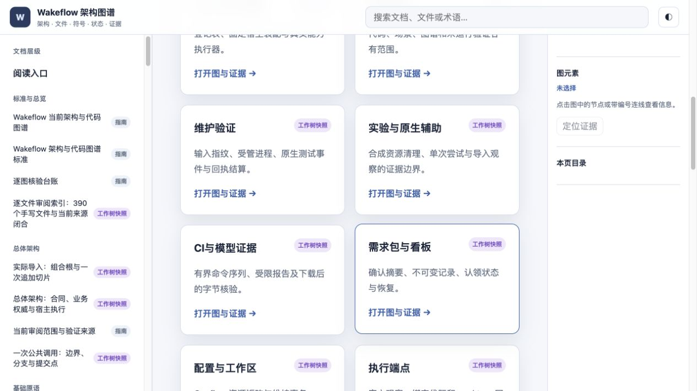

# 维护工具图谱复核与验证来源

本轮日期为 2026-10-03（本地时区），Git 基线 `04769897ea0376112eb1c052223aa546045f5a45`，包含已实现但未提交的维护工具。插件版本仍为 1.1.0-rc.5。本轮修订图谱、入口与证据记录，并修正独立图谱检查器的具名默认导出索引；没有修改Wakeflow运行时或维护工具实现。

## 来源复核

- 完整读取 20 个新增工具文件与 1 个变更运行器，逐条记录职责、分支、效果、消费者、断言范围和限制，见 [21条语义记录](./tooling-files.json)。
- 其余369个手写文件逐一匹配当前SHA、前轮覆盖项和选中的原始semantic记录；前轮台账文件摘要也核对一致。继承不表示本轮重读所有运行时文件。
- [当前覆盖报告](./review-coverage.json)枚举390个手写文件、95份Schema、95份生成TS及306份测试相关TS（273个测试入口）。记录测试新增9份、既有排程测试仅导入顺序变化。
- [静态图库存](./import-graph.json)由现有SWC sourceIndex读取485个模块、3403条本地导入；只证明引用关系，不自动生成语义审阅结论。

旧 `review-2026-10-03-rc4/` 的代码审阅、前后态探针与验证记录保持原样。可变的 current-mermaid-render 派生指针更新前另存 [旧渲染回执](./previous-mermaid-render.json)，该副本只证明旧图来源；本轮渲染另记。

## 根门执行的准确范围

当前维护代码输入指纹与先前完整执行一致：

`sha256:130317dabcfed68566842dc91acbaa169db7e174eaa578b176a436ff7cb9e224`

本轮重新运行了输入指纹采样、CI摘要导出和bundle字节核验，确认下列报告仍对应当前代码。**没有为了文档更新把先前执行重命名成本轮新执行。** docs和独立图谱本来就不在这个代码输入指纹中，其验证由本轮图谱检查单独负责。

| 已执行范围 | 保留结果 | 可查看的受限报告 |
| --- | --- | --- |
| npm test / gate | 1280项、273文件、二十合成场景；零失败/取消/skip/todo；类型、架构、格式、unused、95 Schema与build检查通过 | [gate报告](./validation/gate/report.json)、[摘要清单](./validation/gate/manifest.json) |
| build:check 与双宿主 smoke | 两份当前制品通过，输入未变 | [artifact报告](./validation/artifact/report.json)、[摘要清单](./validation/artifact/manifest.json) |

执行时间在报告中保留UTC原值：2026-10-04 06:00/06:01 UTC，对应本地10月3日。报告只复制允许字段，不包含原始日志、聊天标识或机器根路径；可由 `wf ci verify --bundle` 检查。来源为 unsigned-local-verification-receipt，不是第三方认证或发布证明。[完整来源记录](./validation-provenance.json)。

Codex manifest仍为 `sha256:ab9d9a1e308db758ce88a02fd334b89843f995cfbb4f3b78ceeacabbc5b18735`；Claude为 `sha256:fb4bf0c5eea17b6a25a233f74402cf47711b67d1ab8afe09f3b0b7d6fb203f9f`。没有刷新缓存或改变制品版本。

## 原生验收的事实缺口

| 维度 | 当前已有事实 | 仍需要什么 |
| --- | --- | --- |
| 项目与逻辑窗口 | 先前正式宿主项目清单匹配一个测试区；只读MCP显示5个已有绑定；再次创建被拒绝 | 新的实际场景中保留创建/回读结果，不能只按cwd或标题判断 |
| 运行身份 | 候选文件完整；新stdio观察器报告匹配的manifest | 对应原生角色窗口的实际MCP返回及可解释的关联；当前可信连续关联仍未验证 |
| 投递与回传 | 源码回归和合成场景覆盖相应协议 | 真实宿主发送、落地、回传与独立Controller评审证据 |
| 产品worktree | 已有协议与合成Git场景 | 原生产品检出、角色执行根、交接和两阶段关闭的本轮事实 |
| CI与平台 | workflow和受限导出/破坏校验存在；macOS本地门通过 | 远端Ubuntu/macOS作业实际执行，Windows范围另核验 |

live的准备记录不证明宿主调用已发生；导入JSON即使字段一致，整体仍unavailable/native unverified。图谱不会把这些停止点补画成绿色闭环。当前任务不新建项目、聊天或发送测试消息。

## 本轮图谱检查

语义与证据修订完成后，先计算当前来源摘要，再运行结构/符号/测试锚点检查；浏览器对全部当前Mermaid实际渲染并生成回执后，独立 `npm run check` 完整通过，退出码为0。包含18项检查器回归、阅读器类型检查、79份地图文档、74份当前来源指纹、207条直接导入边、941行相邻边证据、2010个源码符号引用和828个测试符号引用；934行测试证据中542行使用真实锚点，392行明确记录间接或未覆盖范围，未锚定行数为0。

105张图的浏览器渲染回执复验和Vite构建均通过。构建保留超过700 kB的分块提示；这是体积警告，不是本轮修改阈值或跳过检查后的结果。[图谱完整门摘要](./validation/atlas-check.json)保留检查输出和支持代码摘要，[当前派生渲染回执](../evidence/current-mermaid-render.json)保留逐图来源与尺寸。

## 图谱支持代码补审与视觉证据

锚点检查发现SWC将具名默认导出报告器表示为FunctionExpression，旧索引只登记声明节点。新增回归先确认缺失，再纳入具名函数/类表达式；匿名默认导出不制造default符号，注释与字符串仍不能冒充声明。18项检查器测试通过，见[支持代码记录](./atlas-support-review.json)。

阅读器首页原来取总体架构页的旧基线，现统一从当前逐文件索引取基线与审阅路径，并提供三个维护工具入口。实际浏览器确认04769897、390文件索引、维护页导航及全屏/全图控件；[UI观察记录](./reader-ui-verification.json)保留范围。

全部105张当前源图已经实际浏览器渲染，无失败，回执已保存并经完整门复验；截图是派生阅读证据，不拥有代码或业务事实。有限视觉检查的范围见UI记录，不声称逐像素重审全部图。
