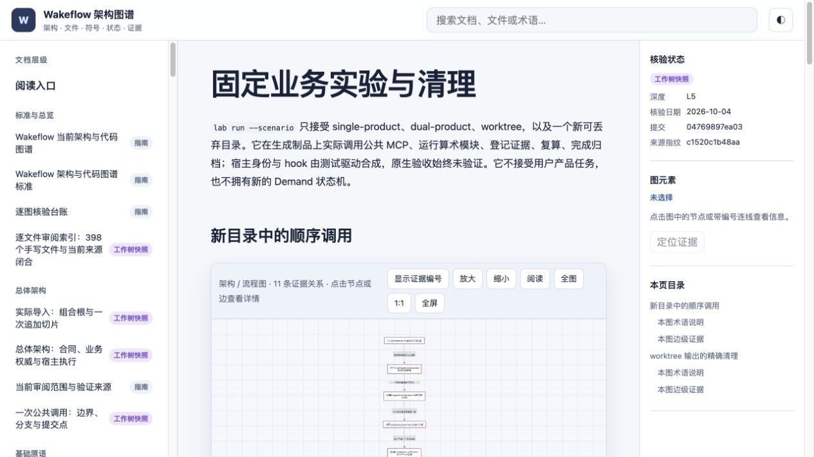
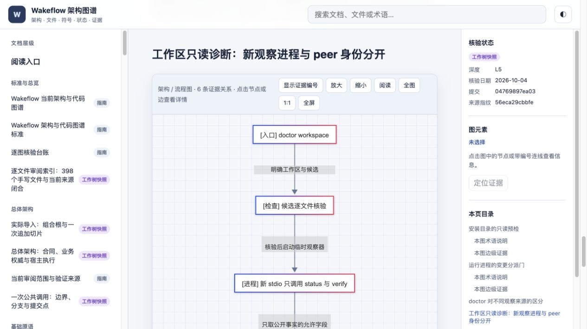

# 固定业务实验与工作区诊断：验证来源

本轮日期2026-10-04，基线仍为 `04769897ea0376112eb1c052223aa546045f5a45` 加未提交维护工具。生产运行时、公共Schema、角色技能、两份rc.5制品与安装缓存未修改。

## 语义范围

[12条完整复核](./tooling-files.json)包含8个新增文件和4个修改文件；[覆盖报告](./review-coverage.json)逐一核对当前398个手写文件，其余386个与原始semantic条目同字节继承。95 Schema、95 generated及309个测试相关TS（276个测试入口）另记库存。旧台账与执行记录保持原样；[静态图库存](./import-graph.json)含493个模块、3437条本地导入，不能代替语义或执行证据。

## 已执行与进行中的检查

- 初版单产品实验完成归档后，严格verify正确报告窗口运行身份不可用。场景随后明确断言这个边界，保留退役前unavailable；退役合成绑定后才要求完整健康检查通过。没有修改生产门。
- 两份生成制品分别执行single-product、dual-product、worktree，六种组合通过；同组的取消、产品修改、未知文件清理与参数拒绝共10项通过。之后又加强Test启动顺序和节点身份清理，最终代码由下述聚焦与整门重新覆盖。
- 资源清单写出后、最终成功回执发布失败的回归，修前因“没有拒绝”失败；修后loadLab要求匹配的成功回执，检查和处置均拒绝中间清单。
- 最新quick包含全仓静态门与15项聚焦回归，全部通过，首尾输入一致；含同字节替换保护、最终回执失败、诊断允许列表、真实零写与失败门。
- 三个新外部根完成实际CLI业务run、inspect、只读readiness、workspace doctor、清理preview、添加未知文件后的拒绝、移除本次探针后的精确清理。三个根和本轮容器均已回收，回执保留。执行期间的工具摘要保存在各私有回执，不把它们称为同一份最终源码全门。
- 首次整门使用2个worker，运行约24分30秒后仍有新增长场景待执行，预计超过固定30分钟外层预算，因此显式中止并保留[中断记录](./validation/interrupted-gate.json)。随后4-worker运行再次观察到长文件晚启动。真实双文件探针与正式回归确认Node CLI重排文件，覆盖了耗时队列；该运行也显式中止并保留[记录](./validation/interrupted-cli-order-gate.json)。改用官方run API后，真实派发保序，终端/事件、失败/取消和子进程退出的27项quick通过；最终新字节完整门通过：1297项、276文件，零失败/取消/skip/todo；测试阶段801237.548 ms，完整命令816483 ms。用例与超时不变，首尾输入一致。旧1280项通过未沿用到本轮新字节。
- 排程修复前的[资源quick受限报告](./validation/quick/report.json)保留15项与完整静态门；bundle实际字节核验通过。[独立CLI汇总](./validation/cli-trials.json)保留各次编译模块摘要及清理拒绝，不冒充最终完整门。
- 工作区doctor实际观察旧测试区的5个绑定：14门通过、1门unavailable；新初始化区未绑定窗口时15门通过。两者都保留new-generated-stdio来源和native unverified，见[既有区](./validation/workspace-existing.json)、[新区](./validation/workspace-fresh.json)。

## 原生范围与保留边界

准备阶段因外层项目未登记，实际CLI live plan以 `live-project-missing-or-ambiguous` 非零拒绝；该历史结果保留。随后人类登记唯一外层项目并确认十个角色聊天的UI归属，本轮完成main/worktree两份原生Codex Demand和资源回收，详见[受限场景证据](./validation/native-scenarios.json)与[gate-log §13.158](../../../docs/progress/consolidation-gate-log.md)。

主流程包含一次坦诚失败的算术提交、Controller独立复现、正式rework及22项独立Test检查。worktree流程包含两个真实产品linked checkout、36项有效Test检查及128组额外隔离性质检查；一次脚本误用轮换快照的故障经正式评审后仅重试ts-2/ts-3，首轮通过和失败文件未覆盖。两份归档各9门通过，全部107个payload文件的归档摘要由源码维护侧再次复算一致。

十个聊天均取得归档成功返回，九个由归档列表回读；最后一个经幂等对账仍返回archived=true且直接读取notLoaded，但列表仍遗漏。退役记录明确采用归档工具的应用状态，没有填造列表条目。十个binding已退役、两份worktree回执随pod关闭退役、两个检出和临时分支已回收，两份已验证Git bundle与原始证据留在可丢弃环境。两个主产品的HEAD、文件、状态、worktree及分支清单均恢复到保存基线。

项目归属的自动回读、窗口到MCP自动关联及回调hook仍不可升级为已验证。八次目标回调实际发送并到达Controller，目标Stop均在评审前确认；UserPromptSubmit hook未观察到，回调投影保留pending/unlanded。绑定存活时verify为14pass/0fail/1unavailable，退役后[实际native及新stdio诊断](./validation/workspace-native-final.json)均15门通过，后者仍明确new-generated-stdio/native unverified。清理后的绿色不补足先前运行身份。live helper仍只支持primary project-bootstrap，真实worktree动作由获授权Agent明确执行。

没有用projectless、角色子项目、codex exec、合成hook或宿主私有数据库补足正式接口限制。Windows、远端CI和新的Claude登录会话仍未执行。

## 本轮图谱

更新资源封存与诊断边界，增加固定业务及worktree节点保护图。独立 `npm run check` 已通过：18项检查器回归、类型、80份文档、75份当前来源指纹、212条直接导入、2080个源码符号、870个测试符号引用、零未锚定证据行，以及构建和108/108张实际浏览器渲染。见[完整图谱检查](./validation/atlas-check.json)、[有限视觉检查](./reader-ui-verification.json)。保留Vite的大分块警告，未改阈值。旧[105图回执](./previous-mermaid-render.json)仅为前态。

## 真实派发接线补审

[复现记录](./validation/scheduling-reproduction.json)区分实际文件执行和argv/显示顺序。CLI传入z、a，执行文件留下a、z；官方程序化run保留z、a。正式回归在修前失败、修后通过。旧台账中“按耗时派发”只核对到排序函数，本轮补齐Node边界；选中文件、进程隔离、并发预算及原生事件格式均保留。[Node 24.19 run API](https://nodejs.org/download/release/v24.19.0/docs/api/test.html#runoptions)。

## 最终交付验证

当前2798文件代码输入为 `sha256:75484da2fcbed378ecaf6775ba32764c67b2632cd20cf40d3f700ba4c0d6ab02`。实际新整门包含原有二十场景及本轮回归，1297项全部通过；双宿主build:check和smoke随后通过，输入一致。见[完整门报告](./validation/gate/report.json)、[制品报告](./validation/artifact/report.json)、[保序接线quick](./validation/scheduling-quick/report.json)及[完整来源记录](./validation-provenance.json)。三份受限bundle都经实际ci verify核验；来源为本地未签名回执，不是发布认证。

两份rc.5清单摘要未变：Codex为 `sha256:ab9d9a1e308db758ce88a02fd334b89843f995cfbb4f3b78ceeacabbc5b18735`，Claude为 `sha256:fb4bf0c5eea17b6a25a233f74402cf47711b67d1ab8afe09f3b0b7d6fb203f9f`。本轮原生main/worktree场景和清理已完成，范围与未验证项见上文；新事实没有改变该代码输入。源码和图谱未提交，未推送、发布或刷新缓存。
